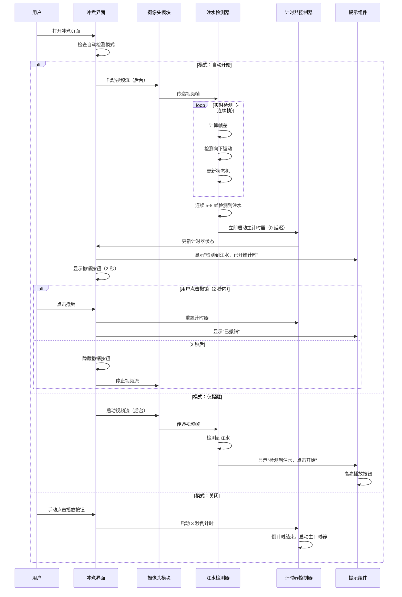
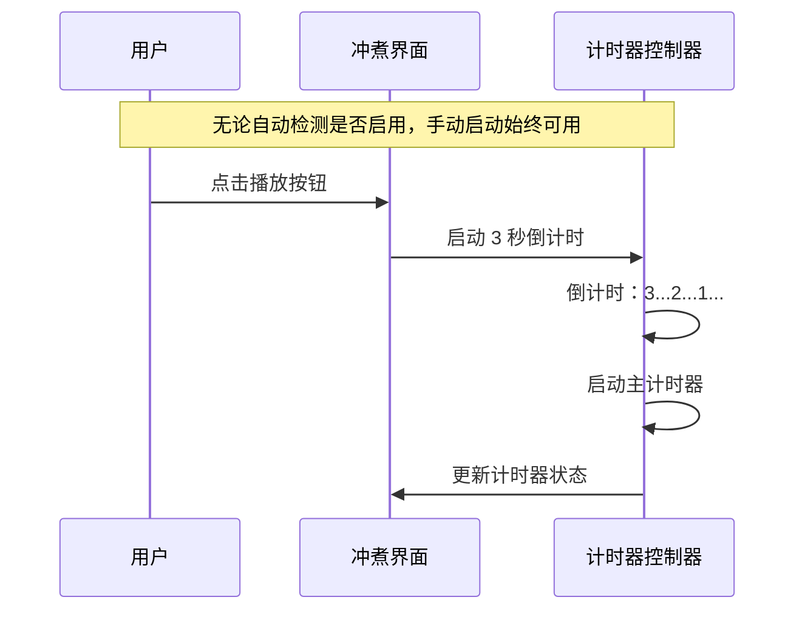
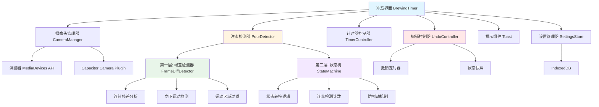
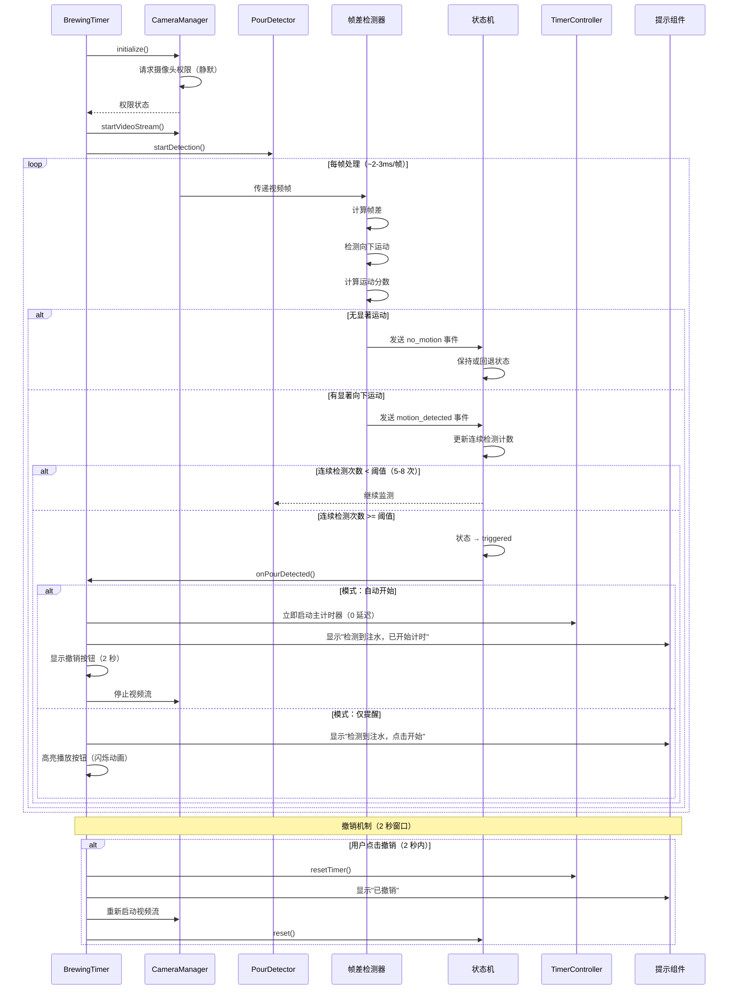

# 设计文档：自动注水检测计时器

## 概述

本功能通过视觉识别技术自动检测"开始注水"动作，并**立即触发**冲煮计时器，消除手动按下播放按钮的需求。该功能将集成到现有的 BrewingTimer 组件中，利用设备摄像头实时分析视频流，识别注水动作。

**关键设计原则**：
1. **零延迟启动**：检测到注水立即启动主计时器（不经过 3 秒倒计时）
2. **简化实现**：采用帧差法 + 状态机，不依赖 ML 模型
3. **用户可控**：提供三种模式（自动开始 / 仅提醒 / 关闭）
4. **允许撤销**：检测触发后 2 秒内可撤销
5. **双重启动**：同时支持手动点击和智能识别

该功能设计为实验性功能，在设置的"实验性功能"中启用/禁用。

## 核心架构：简化版两层检测系统

本设计采用**"帧差法（连续帧检测）+ 状态机（决策逻辑）"**的简化架构：

### 为什么采用简化版？

**简化版的优势**：
1. **实现简单**：无需 ML 模型，无需训练数据，开发周期短
2. **性能优秀**：~2-3ms/帧，极低的资源消耗
3. **体积小**：无需额外的模型文件（节省 ~2.5MB）
4. **快速迭代**：可以快速上线，收集用户反馈后再优化

**如何降低误检测率**：
1. **连续帧检测**：要求连续 5-8 帧检测到运动（~200-300ms）
2. **运动方向过滤**：检测向下的运动（注水特征）
3. **运动区域过滤**：运动区域在画面中上部（手冲壶位置）
4. **状态机防抖**：idle → monitoring → preparing → triggered
5. **用户可撤销**：2 秒内允许撤销误触发

### 摄像头选择：前置摄像头

**为什么使用前置摄像头**：
1. **用户体验优先**：用户在注水时可以看到屏幕上的计时器和冲煮参数
2. **自然使用姿势**：手机平放在桌面或支架上，屏幕朝上，前置摄像头朝向用户
3. **检测可行性**：前置摄像头可以捕捉到用户手部和手冲壶的向下运动
4. **隐私友好**：前置摄像头拍摄的是用户自己的操作区域，不涉及环境隐私

**使用场景**：
- 手机平放在桌面上，屏幕朝上
- 用户站在手机前方进行手冲操作
- 前置摄像头向上拍摄，捕捉手冲壶和手部的向下注水动作
- 用户可以同时看到屏幕上的计时器、阶段提示等信息

**技术实现**：
- 默认使用前置摄像头（`facingMode: 'user'`）
- 在设置中提供摄像头切换选项（前置/后置），但推荐使用前置
- 检测算法针对前置摄像头的视角进行优化（从下往上看的视角）

**视角特性与检测策略**：

由于前置摄像头是仰视视角，注水动作在 2D 画面中的表现与传统俯视不同：

1. **运动特征**：
   - 手冲壶靠近镜头时，画面中物体面积会扩大
   - 注水动作可能表现为"面积扩大" + "画面上部的运动"，而非严格的 Y 轴向下
   - 水流可能表现为局部区域的快速变化

2. **检测策略调整**：
   - **放宽方向限制**：不严格要求 `isDownward = true`，只要在画面上部（`motionRegion === 'top'`）检测到持续显著运动即可
   - **面积变化检测**：计算运动区域的面积变化率，物体靠近时面积增大是注水的重要特征
   - **区域优先**：画面上部（top 1/3）的运动权重更高，因为手冲壶通常在这个区域

3. **算法优化**：
   ```typescript
   // 判断是否为注水特征（针对前置摄像头优化）
   function isPouringMotion(motionAnalysis: MotionAnalysis): boolean {
     // 策略 1: 画面上部的显著运动（主要判断依据）
     const isTopRegionMotion = motionAnalysis.motionRegion === 'top' && 
                                motionAnalysis.motionScore >= 0.5
     
     // 策略 2: 向下运动（辅助判断）
     const hasDownwardBias = motionAnalysis.isDownward && 
                             motionAnalysis.verticalBias > 0.3
     
     // 策略 3: 面积扩大（物体靠近）
     const hasAreaIncrease = motionAnalysis.areaChangeRatio > 0.2
     
     // 满足策略 1 + (策略 2 或策略 3) 即可判定为注水
     return isTopRegionMotion && (hasDownwardBias || hasAreaIncrease)
   }
   ```

### 两层架构

```
第一层：帧差法（连续帧检测）→ 检测持续的向下运动
第二层：状态机（决策逻辑）→ 管理状态转换，防止误触发和重复触发
```

**性能**：
- 帧差法：~2-3ms/帧
- 状态机：~0.5ms/帧
- 总体延迟：~2.5-3.5ms/帧，30 FPS 下完全实时

## 主要工作流程

### 流程 1：自动开始模式



### 流程 2：手动启动（始终可用）



## 架构设计

### 系统架构图（简化版两层架构）



### 两层检测流程（简化版）



## 用户体验（UX）规范

### UX 1: 三种检测模式

**模式 1: 自动开始（auto-start）**
- **行为**: 检测到注水立即启动计时器（0 延迟，跳过 3 秒倒计时）
- **提示**: 显示 Toast "检测到注水，已开始计时"（2 秒）
- **撤销**: 显示撤销按钮（2 秒窗口）
- **摄像头**: 检测成功后自动停止（可配置）
- **适用场景**: 用户希望完全自动化，双手忙于注水

**模式 2: 仅提醒（remind-only）**
- **行为**: 检测到注水显示提示，但不自动启动计时器
- **提示**: 显示 Toast "检测到注水，点击开始"（3 秒，带"开始"按钮）
- **视觉反馈**: 播放按钮高亮闪烁（吸引注意）
- **撤销**: 不需要撤销功能
- **摄像头**: 保持运行，继续检测
- **适用场景**: 用户希望确认后再启动，或者需要调整参数

**模式 3: 关闭（off）**
- **行为**: 完全禁用自动检测
- **提示**: 无
- **启动方式**: 仅手动点击播放按钮（正常 3 秒倒计时）
- **摄像头**: 不启动
- **适用场景**: 用户不需要自动检测，或设备性能不足

### UX 2: Toast 提示通知系统

**Toast 1: 检测成功（自动开始模式）**
```typescript
{
  message: "检测到注水，已开始计时",
  duration: 2000, // 2 秒
  type: "success",
  icon: "✓",
  position: "top-center",
  dismissible: false // 不可手动关闭，自动消失
}
```

**Toast 2: 检测成功（仅提醒模式）**
```typescript
{
  message: "检测到注水，点击开始",
  duration: 3000, // 3 秒
  type: "info",
  icon: "ℹ",
  position: "top-center",
  action: {
    label: "开始",
    onClick: () => startTimer() // 点击启动正常 3 秒倒计时
  },
  dismissible: true // 可手动关闭
}
```

**Toast 3: 撤销确认**
```typescript
{
  message: "已撤销",
  duration: 1000, // 1 秒
  type: "neutral",
  icon: "↶",
  position: "top-center",
  dismissible: false
}
```

**Toast 4: 摄像头权限被拒绝**
```typescript
{
  message: "摄像头权限被拒绝，请在设置中授予权限",
  duration: 5000, // 5 秒
  type: "error",
  icon: "✕",
  position: "top-center",
  action: {
    label: "去设置",
    onClick: () => openSystemSettings()
  },
  dismissible: true
}
```

### UX 3: 撤销按钮（2 秒倒计时窗口）

**视觉设计**:
```
┌─────────────────────────────────┐
│  ✓ 检测到注水，已开始计时        │ ← Toast 提示
└─────────────────────────────────┘

┌─────────────────────────────────┐
│  [↶ 撤销 (2s)]                   │ ← 撤销按钮（固定位置）
└─────────────────────────────────┘
```

**交互行为**:
- **位置**: 屏幕顶部中央，Toast 下方
- **样式**: 半透明背景，白色文字，圆角按钮
- **倒计时**: 显示剩余秒数（2s → 1s → 消失）
- **点击**: 立即撤销，重置计时器，重新启动检测
- **自动消失**: 2 秒后自动隐藏

**实现**:
```typescript
const [showUndoButton, setShowUndoButton] = useState(false)
const [undoTimeRemaining, setUndoTimeRemaining] = useState(2000)

// 启动撤销窗口
const startUndoWindow = () => {
  setShowUndoButton(true)
  setUndoTimeRemaining(2000)
  
  const interval = setInterval(() => {
    setUndoTimeRemaining((prev) => {
      if (prev <= 100) {
        clearInterval(interval)
        setShowUndoButton(false)
        return 0
      }
      return prev - 100
    })
  }, 100)
}

// UI 渲染
{showUndoButton && (
  <button 
    className="undo-button"
    onClick={handleUndo}
  >
    ↶ 撤销 ({Math.ceil(undoTimeRemaining / 1000)}s)
  </button>
)}
```

### UX 4: 摄像头活跃指示器

**视觉设计**:
```
┌─────────────────────────────────┐
│  ● 摄像头已启用    [停止]        │
└─────────────────────────────────┘
```

**交互行为**:
- **位置**: 屏幕顶部，固定显示
- **样式**: 红色圆点（录制指示），半透明背景
- **停止按钮**: 一键停止摄像头和检测
- **隐私保护**: 明确告知用户摄像头正在使用

### UX 5: 检测状态指示器（调试模式）

**视觉设计**:
```
┌─────────────────────────────────┐
│  状态: monitoring                │
│  连续检测: 3/5                   │
│  运动分数: 0.72                  │
│  处理时间: 2.8ms                 │
└─────────────────────────────────┘
```

**显示条件**:
- 仅在设置中启用"显示调试信息"时显示
- 开发者和高级用户使用

### UX 6: 设置界面

**设置项布局**:
```
实验性功能
├── 自动注水检测
    ├── 检测模式
    │   ├── ○ 自动开始（检测到注水立即启动）
    │   ├── ○ 仅提醒（检测到注水显示提示）
    │   └── ● 关闭
    │
    ├── 摄像头设置
    │   ├── 摄像头朝向: [● 前置（推荐） / ○ 后置]
    │   ├── 视频分辨率: [320x240 / 640x480]
    │   └── 帧率: [15 / 30 / 60 FPS]
    │
    ├── 检测参数（高级）
    │   ├── 灵敏度: [滑块 0-100]
    │   ├── 连续检测次数: [5-8]
    │   └── 状态超时: [5000ms]
    │
    └── 界面选项
        ├── ☑ 显示摄像头预览
        ├── ☐ 显示调试信息
        └── ☑ 检测成功后自动停止摄像头
```

**实验性功能标识**:
- 在设置中标记为"实验性功能"
- 显示警告："此功能正在测试中，可能不稳定"
- 提供反馈入口："遇到问题？点击反馈"

### UX 7: 首次使用引导

**引导流程**:
1. **步骤 1**: 介绍功能
   - "自动注水检测可以在您开始注水时自动启动计时器"
   - 显示动画演示

2. **步骤 2**: 请求摄像头权限
   - "需要访问前置摄像头来检测注水动作"
   - "将手机平放在桌面，屏幕朝上，前置摄像头会检测您的注水动作"
   - "您的视频不会被存储或上传"

3. **步骤 3**: 选择检测模式
   - 三种模式的说明和推荐
   - 默认推荐"仅提醒"模式

4. **步骤 4**: 测试检测
   - "请将手机平放在桌面，屏幕朝上"
   - "尝试在手机上方做注水动作，测试检测是否正常"
   - 显示实时检测状态和摄像头预览

### UX 8: 播放按钮高亮（仅提醒模式）

**视觉效果**:
- 播放按钮边框闪烁（绿色光晕）
- 脉冲动画（放大 → 缩小）
- 持续 3 秒，与 Toast 同步

**实现**:
```typescript
const [highlightPlayButton, setHighlightPlayButton] = useState(false)

// 高亮播放按钮
const highlightButton = () => {
  setHighlightPlayButton(true)
  setTimeout(() => setHighlightPlayButton(false), 3000)
}

// CSS 动画
.play-button.highlighted {
  animation: pulse 1s ease-in-out infinite;
  box-shadow: 0 0 20px rgba(0, 255, 0, 0.6);
}

@keyframes pulse {
  0%, 100% { transform: scale(1); }
  50% { transform: scale(1.1); }
}
```

### UX 9: 零延迟启动（关键特性）

**行为对比**:

**传统手动启动**:
1. 用户点击播放按钮
2. 显示 3 秒倒计时（3...2...1...）
3. 倒计时结束后启动主计时器

**自动开始模式（零延迟）**:
1. 检测到注水
2. **立即启动主计时器**（跳过 3 秒倒计时）
3. 显示 Toast 和撤销按钮

**实现**:
```typescript
// 传统启动（手动点击）
const startTimer = () => {
  startCountdown(3) // 3 秒倒计时
  onCountdownEnd(() => {
    startMainTimer() // 倒计时结束后启动主计时器
  })
}

// 零延迟启动（自动检测）
const startTimerImmediately = () => {
  startMainTimer() // 直接启动主计时器，跳过倒计时
  setIsRunning(true)
  setHasStartedOnce(true)
}
```

### UX 10: 错误状态处理

**错误 1: 摄像头权限被拒绝**
- Toast 提示："摄像头权限被拒绝，请在设置中授予权限"
- 提供"去设置"按钮
- 自动禁用自动检测功能

**错误 2: 摄像头设备不可用**
- Toast 提示："未检测到可用摄像头"
- 自动禁用自动检测功能
- 提供"重试"按钮

**错误 3: 检测性能不足**
- Toast 提示："设备性能不足，建议使用手动启动"
- 提供"降低检测质量"选项
- 或切换到手动启动模式

## 组件和接口

### 组件 1: CameraManager（摄像头管理器）

**目的**: 管理设备摄像头的访问、视频流的启动/停止、以及跨平台兼容性处理

**接口**:
```typescript
interface CameraManager {
  // 初始化摄像头管理器
  initialize(): Promise<CameraInitResult>
  
  // 请求摄像头权限
  requestPermission(): Promise<PermissionStatus>
  
  // 启动视频流
  startVideoStream(config: VideoStreamConfig): Promise<MediaStream>
  
  // 停止视频流
  stopVideoStream(): void
  
  // 获取可用摄像头列表
  getAvailableCameras(): Promise<CameraDevice[]>
  
  // 切换摄像头
  switchCamera(deviceId: string): Promise<void>
  
  // 获取当前视频流状态
  getStreamStatus(): VideoStreamStatus
}

interface CameraInitResult {
  success: boolean
  error?: string
  supportedFeatures: {
    multipleCamera: boolean
    focusControl: boolean
    exposureControl: boolean
  }
}

interface VideoStreamConfig {
  deviceId?: string
  width?: number
  height?: number
  frameRate?: number
  facingMode?: 'user' | 'environment' // 'user' = 前置摄像头（默认），'environment' = 后置摄像头
}

interface CameraDevice {
  deviceId: string
  label: string
  kind: 'videoinput'
}

type VideoStreamStatus = 'idle' | 'initializing' | 'active' | 'error'
type PermissionStatus = 'granted' | 'denied' | 'prompt'
```

**职责**:
- 处理浏览器和 Capacitor 环境下的摄像头访问
- 管理视频流的生命周期
- 提供摄像头设备枚举和切换功能
- 处理权限请求和错误状态


### 组件 2: PourDetector（注水检测器 - 两层架构）

**目的**: 协调两层检测系统，分析视频帧，检测注水动作，并触发计时器启动事件

**接口**:
```typescript
interface PourDetector {
  // 启动检测
  startDetection(config: DetectionConfig): void
  
  // 停止检测
  stopDetection(): void
  
  // 处理单帧（两层流水线）
  processFrame(frame: VideoFrame): DetectionResult
  
  // 设置检测回调
  onPourDetected(callback: () => void): void
  
  // 获取检测状态
  getDetectionStatus(): DetectionStatus
  
  // 更新检测配置
  updateConfig(config: Partial<DetectionConfig>): void
  
  // 获取当前状态机状态
  getCurrentState(): DetectionStateMachine['state']
}

interface DetectionConfig {
  sensitivity: number // 0-100, 检测灵敏度
  frameDiffThreshold: number // 0-255, 帧差阈值（第一层）
  minMotionRatio: number // 0-1, 最小运动像素比例
  maxMotionRatio: number // 0-1, 最大运动像素比例（防止全屏剧变）
  requiredConsecutiveDetections: number // 状态转换所需的连续检测次数（第二层）
  stateTimeout: number // 状态超时时间（毫秒）
  cooldownDuration: number // 撤销后的冷却时间（毫秒）
  regionOfInterest?: {
    x: number
    y: number
    width: number
    height: number
  }
}

interface DetectionResult {
  // 第一层结果
  hasMotion: boolean
  motionScore: number
  isDownward: boolean
  motionRegion: 'top' | 'middle' | 'bottom'
  
  // 第二层结果
  currentState: DetectionStateMachine['state']
  shouldTrigger: boolean
  consecutiveCount: number
  
  // 元数据
  timestamp: number
  processingTime: number
}

interface DetectionStatus {
  isActive: boolean
  currentState: DetectionStateMachine['state']
  frameCount: number
  processedFrameCount: number // 通过第一层的帧数
  lastDetectionTime: number | null
  averageProcessingTime: number
  performanceMetrics: {
    layer1AvgTime: number // 帧差平均耗时
    layer2AvgTime: number // 状态机平均耗时
    fps: number
    droppedFrames: number
  }
}

interface VideoFrame {
  data: ImageData
  timestamp: number
  width: number
  height: number
}
```

**职责**:
- 协调两层检测流水线
- 管理帧差检测器、状态机
- 触发注水检测事件
- 提供详细的性能指标和状态信息


### 组件 3: FrameProcessor（视频帧处理器）

**目的**: 从视频流中提取帧数据，并进行预处理

**接口**:
```typescript
interface FrameProcessor {
  // 初始化处理器
  initialize(videoElement: HTMLVideoElement): void
  
  // 开始帧捕获（优先使用 requestVideoFrameCallback）
  startCapture(frameRate: number): void
  
  // 停止帧捕获
  stopCapture(): void
  
  // 获取当前帧
  getCurrentFrame(): VideoFrame | null
  
  // 设置帧回调
  onFrameReady(callback: (frame: VideoFrame) => void): void
  
  // 检查是否支持 requestVideoFrameCallback
  supportsVideoFrameCallback(): boolean
}
```

**职责**:
- 从 video 元素捕获视频帧
- 控制帧捕获频率
- 将视频帧转换为 ImageData 格式
- 提供帧数据给检测器
- **性能优化**：优先使用 `requestVideoFrameCallback()` API（比 `requestAnimationFrame` 更高效，只在视频有新帧时触发）

### 组件 4: FrameDiffDetector（第一层：连续帧差检测器）

**目的**: 通过连续帧差分析检测持续的向下运动，识别注水动作

**接口**:
```typescript
interface FrameDiffDetector {
  // 计算帧差
  computeFrameDiff(currentFrame: ImageData, previousFrame: ImageData): FrameDiffResult
  
  // 检测向下运动
  detectDownwardMotion(diffMap: number[][], threshold: number): MotionAnalysis
  
  // 判断是否为注水特征
  isPouringMotion(motionAnalysis: MotionAnalysis): boolean
}

interface FrameDiffResult {
  diffMap: number[][] // 像素级差异图
  totalDiff: number // 总差异值
  motionPixelCount: number // 运动像素数量
  motionRatio: number // 运动像素比例 (0-1)
  maxDiff: number // 最大差异值
  motionCenterY: number // 运动中心 Y 坐标（归一化 0-1）
  isLargeSceneChange: boolean // 是否为全屏剧变（motionRatio > 0.8）
}

interface MotionAnalysis {
  hasMotion: boolean // 是否有显著运动
  isDownward: boolean // 是否为向下运动
  motionScore: number // 运动分数 (0-1)
  verticalBias: number // 垂直偏向度 (-1 到 1，正值表示向下)
  motionRegion: 'top' | 'middle' | 'bottom' // 运动区域位置
  areaChangeRatio: number // 运动区域面积变化率（正值表示扩大，负值表示缩小）
  isLargeSceneChange: boolean // 是否为全屏剧变（光线突变或手机移动）
}
```

**职责**:
- 快速计算帧间差异（~2-3ms）
- 分析运动方向（向下运动是注水的关键特征）
- 判断运动区域位置（注水通常在画面上半部）
- 提供运动分数给状态机
- **针对前置摄像头优化**：
  - 检测画面上部（top 1/3）的运动（手冲壶区域）
  - 计算运动区域面积变化率（物体靠近时面积扩大）
  - 过滤全屏剧变（光线突变或手机移动，motionRatio > 0.8）
  - 放宽方向限制，优先依赖区域位置判断


### 组件 5: DetectionStateMachine（第二层：状态机）

**目的**: 管理检测状态转换，通过连续检测防止误触发和重复触发

**接口**:
```typescript
interface DetectionStateMachine {
  // 当前状态
  state: 'idle' | 'monitoring' | 'preparing' | 'triggered' | 'cooldown'
  
  // 状态转换
  transition(event: StateMachineEvent): StateTransitionResult
  
  // 重置状态机（进入冷却状态）
  reset(): void
  
  // 获取连续检测计数
  getConsecutiveCount(): number
  
  // 获取冷却剩余时间
  getCooldownRemaining(): number
  
  // 获取状态历史
  getStateHistory(): StateHistoryEntry[]
}

interface StateMachineEvent {
  type: 'motion_detected' | 'no_motion' | 'scene_change' | 'timeout' | 'manual_reset'
  motionScore: number // 0-1
  isDownward: boolean // 是否为向下运动
  motionRegion: 'top' | 'middle' | 'bottom' // 运动区域位置
  timestamp: number
}

interface StateTransitionResult {
  previousState: DetectionStateMachine['state']
  currentState: DetectionStateMachine['state']
  shouldTriggerTimer: boolean
  consecutiveCount: number
  transitionReason: string
}

interface StateHistoryEntry {
  state: DetectionStateMachine['state']
  timestamp: number
  duration: number
  consecutiveCount: number
}
```

**职责**:
- 管理检测状态的转换逻辑
- 实现连续检测计数（防抖动机制）
- 防止重复触发
- 处理超时和异常状态
- 提供状态历史用于调试
- **冷却机制**：撤销后进入 cooldown 状态，防止立即重新触发（需连续静止或等待 2 秒）

### 组件 6: UndoController（撤销控制器）

**目的**: 管理自动触发后的撤销功能，防止误触发影响用户体验

**接口**:
```typescript
interface UndoController {
  // 启动撤销窗口
  startUndoWindow(duration: number): void
  
  // 执行撤销
  undo(): void
  
  // 取消撤销窗口
  cancelUndoWindow(): void
  
  // 检查是否在撤销窗口内
  isUndoAvailable(): boolean
  
  // 获取剩余撤销时间
  getRemainingTime(): number
}

interface UndoState {
  isAvailable: boolean
  remainingTime: number // 毫秒
  timerSnapshot: {
    currentTime: number
    isRunning: boolean
    hasStartedOnce: boolean
  }
}
```

**职责**:
- 管理 2 秒撤销窗口
- 保存计时器状态快照
- 执行撤销操作（恢复到检测前状态）
- 提供倒计时显示

### 组件 6: UndoController（撤销控制器）

**目的**: 管理自动触发后的撤销功能，防止误触发影响用户体验

**接口**:
```typescript
interface UndoController {
  // 启动撤销窗口
  startUndoWindow(duration: number): void
  
  // 执行撤销
  undo(): void
  
  // 取消撤销窗口
  cancelUndoWindow(): void
  
  // 检查是否在撤销窗口内
  isUndoAvailable(): boolean
  
  // 获取剩余撤销时间
  getRemainingTime(): number
}

interface UndoState {
  isAvailable: boolean
  remainingTime: number // 毫秒
  timerSnapshot: {
    currentTime: number
    isRunning: boolean
    hasStartedOnce: boolean
  }
}
```

**职责**:
- 管理 2 秒撤销窗口
- 保存计时器状态快照
- 执行撤销操作（恢复到检测前状态）
- 提供倒计时显示

## 数据模型

### 模型 1: AutoPourDetectionSettings（自动注水检测设置）

```typescript
interface AutoPourDetectionSettings {
  enabled: boolean // 是否启用自动检测
  mode: 'auto-start' | 'remind-only' | 'off' // 检测模式
  
  // 第一层：帧差检测配置
  frameDiffThreshold: number // 帧差阈值 (0-255)
  minMotionRatio: number // 最小运动像素比例 (0-1)
  
  // 第二层：状态机配置
  requiredConsecutiveDetections: number // 触发所需的连续检测次数
  stateTimeout: number // 状态超时时间（毫秒）
  cooldownDuration: number // 撤销后的冷却时间（毫秒，默认 2000）
  maxMotionRatio: number // 最大运动像素比例（0-1，默认 0.8，防止全屏剧变）
  
  // 摄像头配置
  cameraDeviceId: string | null // 选择的摄像头设备 ID
  cameraFacingMode: 'user' | 'environment' // 摄像头朝向：'user' = 前置（默认推荐），'environment' = 后置
  videoResolution: { width: number; height: number } // 视频分辨率
  frameRate: number // 帧率 (15/30/60)
  
  // UI 配置
  showCameraPreview: boolean // 是否显示摄像头预览
  showDebugOverlay: boolean // 是否显示调试信息（帧差图、运动区域）
  autoStopCamera: boolean // 检测成功后自动停止摄像头
  
  // UX 配置
  showToastNotification: boolean // 是否显示提示通知
  undoWindowDuration: number // 撤销窗口时长（毫秒，默认 2000）
  
  // 性能配置
  useWebWorker: boolean // 是否使用 Web Worker
  downsampleScale: number // 降采样比例 (0.25-1.0)
  regionOfInterest: {
    enabled: boolean
    x: number
    y: number
    width: number
    height: number
  } | null
}
```

**验证规则**:
- `sensitivity` 必须在 0-100 之间
- `mode` 必须是 'auto-start'、'remind-only' 或 'off' 之一
- `frameDiffThreshold` 必须在 0-255 之间
- `minMotionRatio` 必须在 0-1 之间
- `requiredConsecutiveDetections` 必须大于 0
- `stateTimeout` 必须大于 0
- `undoWindowDuration` 必须大于 0
- `regionOfInterest` 坐标和尺寸必须在有效范围内


### 模型 2: CameraState（摄像头状态）

```typescript
interface CameraState {
  status: 'idle' | 'requesting-permission' | 'initializing' | 'active' | 'error'
  permissionStatus: 'granted' | 'denied' | 'prompt' | 'unknown'
  currentDeviceId: string | null
  availableDevices: CameraDevice[]
  stream: MediaStream | null
  error: CameraError | null
}

interface CameraError {
  code: 'PERMISSION_DENIED' | 'DEVICE_NOT_FOUND' | 'STREAM_ERROR' | 'UNKNOWN'
  message: string
  timestamp: number
}
```

### 模型 3: DetectionState（检测状态）

```typescript
interface DetectionState {
  isActive: boolean
  isDetecting: boolean
  lastDetectionTime: number | null
  detectionHistory: DetectionEvent[]
  currentScore: number
  frameCount: number
  averageProcessingTime: number
  performanceMetrics: {
    fps: number
    avgLatency: number
    droppedFrames: number
  }
}
```

## 关键函数的形式化规范

### 函数 1: processFrame()

```typescript
function processFrame(
  currentFrame: ImageData,
  previousFrame: ImageData | null,
  config: DetectionConfig
): DetectionResult
```

**前置条件**:
- `currentFrame` 是有效的 ImageData 对象
- `currentFrame.width > 0` 且 `currentFrame.height > 0`
- `config.sensitivity` 在 [0, 100] 范围内
- `config.minConfidence` 在 [0, 1] 范围内

**后置条件**:
- 返回有效的 DetectionResult 对象
- `result.confidence` 在 [0, 1] 范围内
- `result.detected === true` 当且仅当 `result.confidence >= config.minConfidence`
- 不修改输入的 `currentFrame` 和 `previousFrame`

**循环不变式**: 不适用（无循环）


### 函数 2: extractMotion()

```typescript
function extractMotion(
  currentFrame: ImageData,
  previousFrame: ImageData
): MotionFeatures
```

**前置条件**:
- `currentFrame` 和 `previousFrame` 是有效的 ImageData 对象
- `currentFrame.width === previousFrame.width`
- `currentFrame.height === previousFrame.height`
- 两帧的尺寸大于 0

**后置条件**:
- 返回有效的 MotionFeatures 对象
- `result.motionMagnitude >= 0`
- `result.motionDirection` 在 [0, 360) 范围内
- `result.motionArea >= 0`
- 不修改输入的帧数据

**循环不变式**:
- 在遍历像素时，所有已处理像素的运动值已正确累加
- 运动幅度计算保持非负

### 函数 3: calculateScore()

```typescript
function calculateScore(features: ExtractedFeatures, config: DetectionConfig): number
```

**前置条件**:
- `features` 包含有效的 motion、color 和 edges 特征
- `config.detectionMethod` 是有效的检测方法
- 所有特征值都是非负数

**后置条件**:
- 返回值在 [0, 1] 范围内
- 分数基于 `config.detectionMethod` 正确计算
- 不修改输入的 `features` 和 `config`

**循环不变式**: 不适用（无循环）

## 算法伪代码

### 主检测算法（两层流水线）

```pascal
ALGORITHM detectPourFromVideoStream(videoStream, config)
INPUT: videoStream (MediaStream), config (DetectionConfig)
OUTPUT: detectionEvent (boolean)

BEGIN
  ASSERT videoStream is valid AND config is valid
  
  // 初始化两层检测系统
  frameDiffDetector ← new FrameDiffDetector()
  stateMachine ← new DetectionStateMachine()
  
  // 初始化状态
  previousFrame ← null
  frameCount ← 0
  
  // 主检测循环
  WHILE videoStream is active AND stateMachine.state ≠ 'triggered' DO
    startTime ← currentTime()
    
    // 步骤 1: 捕获当前帧
    currentFrame ← captureFrame(videoStream)
    IF currentFrame is null THEN
      CONTINUE
    END IF
    
    frameCount ← frameCount + 1
    
    // 步骤 2: 第一层 - 帧差检测（快速筛选）
    IF previousFrame is not null THEN
      layer1StartTime ← currentTime()
      
      diffResult ← frameDiffDetector.computeFrameDiff(currentFrame, previousFrame)
      motionAnalysis ← frameDiffDetector.detectDownwardMotion(
        diffResult.diffMap,
        config.frameDiffThreshold
      )
      
      layer1Time ← currentTime() - layer1StartTime
      
      // 过滤全屏剧变（光线突变或手机移动）
      IF motionAnalysis.isLargeSceneChange THEN
        stateMachine.transition({ 
          type: 'scene_change', 
          timestamp: currentTime() 
        })
        previousFrame ← currentFrame
        CONTINUE  // 跳过此帧，防止误触发
      END IF
      
      // 如果无显著运动，跳过后续处理
      IF NOT motionAnalysis.hasMotion THEN
        stateMachine.transition({ 
          type: 'no_motion', 
          timestamp: currentTime() 
        })
        previousFrame ← currentFrame
        CONTINUE  // 跳过此帧，节省计算（~2-3ms）
      END IF
      
      // 步骤 3: 第二层 - 状态机（决策逻辑）
      layer2StartTime ← currentTime()
      
      // 向状态机发送运动检测事件
      transitionResult ← stateMachine.transition({
        type: 'motion_detected',
        motionScore: motionAnalysis.motionScore,
        isDownward: motionAnalysis.isDownward,
        timestamp: currentTime()
      })
      
      layer2Time ← currentTime() - layer2StartTime
      
      // 如果状态机决定触发计时器
      IF transitionResult.shouldTriggerTimer THEN
        RETURN true  // 检测成功，触发计时器
      END IF
    END IF
    
    // 更新状态
    previousFrame ← currentFrame
    
    // 性能监控
    totalTime ← currentTime() - startTime
    IF totalTime > 1000 / config.frameRate THEN
      // 处理时间超过帧间隔，可能丢帧
      logWarning("Frame processing too slow: " + totalTime + "ms")
    END IF
  END WHILE
  
  RETURN false
END
```

**前置条件**:
- `videoStream` 是活跃的 MediaStream
- `config` 包含有效的检测配置
- 摄像头权限已授予

**后置条件**:
- 返回 `true` 当且仅当状态机决定触发计时器
- 所有帧处理完成后，状态正确更新
- 所有资源（缓冲区）正确释放

**循环不变式**:
- `frameCount` 等于已处理的帧数
- `previousFrame` 始终是上一帧的有效引用
- `stateMachine.state` 始终是有效状态
- 状态机不会从 'triggered' 状态回退


### 第一层：帧差检测算法

```pascal
ALGORITHM computeFrameDiff(currentFrame, previousFrame, threshold)
INPUT: currentFrame (ImageData), previousFrame (ImageData), threshold (number)
OUTPUT: FrameDiffResult

BEGIN
  ASSERT currentFrame.width = previousFrame.width
  ASSERT currentFrame.height = previousFrame.height
  ASSERT 0 ≤ threshold ≤ 255
  
  width ← currentFrame.width
  height ← currentFrame.height
  totalPixels ← width × height
  
  // 初始化差异图和累加器
  diffMap ← 2D array[height][width]
  totalDiff ← 0
  motionPixelCount ← 0
  maxDiff ← 0
  
  // 遍历所有像素计算差异
  FOR y ← 0 TO height - 1 DO
    FOR x ← 0 TO width - 1 DO
      ASSERT 0 ≤ motionPixelCount ≤ totalPixels
      
      // 获取灰度值
      currentGray ← getGrayscale(currentFrame, x, y)
      previousGray ← getGrayscale(previousFrame, x, y)
      
      // 计算绝对差异
      diff ← abs(currentGray - previousGray)
      diffMap[y][x] ← diff
      
      // 累加统计
      totalDiff ← totalDiff + diff
      IF diff > threshold THEN
        motionPixelCount ← motionPixelCount + 1
      END IF
      IF diff > maxDiff THEN
        maxDiff ← diff
      END IF
    END FOR
  END FOR
  
  // 计算运动比例
  motionRatio ← motionPixelCount / totalPixels
  
  // 检测全屏剧变（光线突变或手机移动）
  isLargeSceneChange ← (motionRatio > 0.8)  // 超过 80% 像素变化
  
  // 如果是全屏剧变，直接返回（不提取候选区域）
  IF isLargeSceneChange THEN
    RETURN {
      diffMap: diffMap,
      totalDiff: totalDiff,
      motionPixelCount: motionPixelCount,
      motionRatio: motionRatio,
      maxDiff: maxDiff,
      isLargeSceneChange: true,
      candidateROIs: []
    }
  END IF
  
  // 提取候选区域（连通域分析）
  candidateROIs ← extractConnectedRegions(diffMap, threshold)
  
  RETURN {
    diffMap: diffMap,
    totalDiff: totalDiff,
    motionPixelCount: motionPixelCount,
    motionRatio: motionRatio,
    maxDiff: maxDiff,
    isLargeSceneChange: false,
    candidateROIs: candidateROIs
  }
END
```

**前置条件**:
- 两帧尺寸相同
- `threshold` 在 [0, 255] 范围内

**后置条件**:
- `motionRatio` 在 [0, 1] 范围内
- `candidateROIs` 按运动分数降序排列
- 不修改输入帧

**循环不变式**:
- `motionPixelCount ≤ totalPixels`
- `totalDiff ≥ 0`
- 所有已处理像素的差异值已正确记录

**性能**: ~2-3ms/帧（320x240 分辨率）

### 前置摄像头运动分析算法（针对仰视视角优化）

```pascal
ALGORITHM detectDownwardMotion(diffMap, threshold, previousROI)
INPUT: diffMap (2D array), threshold (number), previousROI (BoundingBox | null)
OUTPUT: MotionAnalysis

BEGIN
  ASSERT diffMap is valid 2D array
  ASSERT 0 ≤ threshold ≤ 255
  
  height ← diffMap.length
  width ← diffMap[0].length
  
  // 初始化累加器
  totalMotionPixels ← 0
  motionCenterX ← 0
  motionCenterY ← 0
  topRegionMotion ← 0  // 画面上部（top 1/3）的运动像素数
  
  // 遍历所有像素，统计运动信息
  FOR y ← 0 TO height - 1 DO
    FOR x ← 0 TO width - 1 DO
      IF diffMap[y][x] > threshold THEN
        totalMotionPixels ← totalMotionPixels + 1
        motionCenterX ← motionCenterX + x
        motionCenterY ← motionCenterY + y
        
        // 统计画面上部的运动
        IF y < height / 3 THEN
          topRegionMotion ← topRegionMotion + 1
        END IF
      END IF
    END FOR
  END FOR
  
  // 如果无运动，直接返回
  IF totalMotionPixels = 0 THEN
    RETURN {
      hasMotion: false,
      isDownward: false,
      motionScore: 0,
      verticalBias: 0,
      motionRegion: 'middle',
      areaChangeRatio: 0,
      isLargeSceneChange: false
    }
  END IF
  
  // 计算运动中心（归一化到 [0, 1]）
  motionCenterX ← motionCenterX / totalMotionPixels / width
  motionCenterY ← motionCenterY / totalMotionPixels / height
  
  // 判断运动区域位置
  IF motionCenterY < 0.33 THEN
    motionRegion ← 'top'
  ELSE IF motionCenterY < 0.67 THEN
    motionRegion ← 'middle'
  ELSE
    motionRegion ← 'bottom'
  END IF
  
  // 计算垂直偏向度（辅助特征）
  // 注意：前置摄像头仰视，向下运动可能不明显
  verticalBias ← calculateVerticalBias(diffMap, threshold)
  isDownward ← (verticalBias > 0.3)
  
  // 计算面积变化率（关键特征：物体靠近时面积扩大）
  currentROI ← extractLargestConnectedRegion(diffMap, threshold)
  areaChangeRatio ← 0
  IF previousROI is not null AND currentROI is not null THEN
    currentArea ← currentROI.width × currentROI.height
    previousArea ← previousROI.width × previousROI.height
    areaChangeRatio ← (currentArea - previousArea) / previousArea
  END IF
  
  // 计算运动分数（综合评估）
  // 针对前置摄像头：画面上部运动 + 面积扩大 = 高分
  topRegionRatio ← topRegionMotion / totalMotionPixels
  motionScore ← 0.5 × topRegionRatio + 0.3 × max(0, areaChangeRatio) + 0.2 × max(0, verticalBias)
  motionScore ← clamp(motionScore, 0, 1)
  
  // 判断是否有显著运动
  hasMotion ← (motionScore >= 0.3)
  
  RETURN {
    hasMotion: hasMotion,
    isDownward: isDownward,
    motionScore: motionScore,
    verticalBias: verticalBias,
    motionRegion: motionRegion,
    areaChangeRatio: areaChangeRatio,
    isLargeSceneChange: false
  }
END
```

**前置条件**:
- `diffMap` 是有效的 2D 数组
- `threshold` 在 [0, 255] 范围内

**后置条件**:
- `motionScore` 在 [0, 1] 范围内
- `verticalBias` 在 [-1, 1] 范围内
- `areaChangeRatio` 可以是任意实数（正值表示扩大，负值表示缩小）
- 不修改输入的 `diffMap`

**针对前置摄像头的优化**:
- **画面上部优先**：top 1/3 区域的运动权重占 50%
- **面积变化检测**：物体靠近时面积扩大，权重占 30%
- **垂直偏向辅助**：向下运动作为辅助特征，权重仅占 20%
- **放宽方向限制**：不严格要求 `isDownward = true`，只要在画面上部有显著运动即可

**性能**: ~3-4ms/帧（320x240 分辨率，增加了面积计算）


### 第二层：状态机决策算法

```pascal
ALGORITHM stateMachineTransition(currentState, event, config)
INPUT: currentState (State), event (StateMachineEvent), config (DetectionConfig)
OUTPUT: StateTransitionResult

BEGIN
  ASSERT currentState is valid state

*性能**: ~2-3ms/帧（320x240 分辨率）

### 前置摄像头运动分析算法（针对仰视视角优化）

```pascal
ALGORITHM detectDownwardMotion(diffMap, threshold, previousROI)
INPUT: diffMap (2D array), threshold (number), previousROI (BoundingBox | null)
OUTPUT: MotionAnalysis

BEGIN
  ASSERT diffMap is valid 2D array
  ASSERT 0 ≤ threshold ≤ 255
  
  height ← diffMap.length
  width ← diffMap[0].length
  
  // 初始化累加器
  totalMotionPixels ← 0
  motionCenterX ← 0
  motionCenterY ← 0
  topRegionMotion ← 0  // 画面上部（top 1/3）的运动像素数
  
  // 遍历所有像素，统计运动信息
  FOR y ← 0 TO height - 1 DO
    FOR x ← 0 TO width - 1 DO
      IF diffMap[y][x] > threshold THEN
        totalMotionPixels ← totalMotionPixels + 1
        motionCenterX ← motionCenterX + x
        motionCenterY ← motionCenterY + y
        
        // 统计画面上部的运动
        IF y < height / 3 THEN
          topRegionMotion ← topRegionMotion + 1
        END IF
      END IF
    END FOR
  END FOR
  
  // 如果无运动，直接返回
  IF totalMotionPixels = 0 THEN
    RETURN {
      hasMotion: false,
      isDownward: false,
      motionScore: 0,
      verticalBias: 0,
      motionRegion: 'middle',
      areaChangeRatio: 0,
      isLargeSceneChange: false
    }
  END IF
  
  // 计算运动中心（归一化到 [0, 1]）
  motionCenterX ← motionCenterX / totalMotionPixels / width
  motionCenterY ← motionCenterY / totalMotionPixels / height
  
  // 判断运动区域位置
  IF motionCenterY < 0.33 THEN
    motionRegion ← 'top'
  ELSE IF motionCenterY < 0.67 THEN
    motionRegion ← 'middle'
  ELSE
    motionRegion ← 'bottom'
  END IF
  
  // 计算垂直偏向度（辅助特征）
  // 注意：前置摄像头仰视，向下运动可能不明显
  verticalBias ← calculateVerticalBias(diffMap, threshold)
  isDownward ← (verticalBias > 0.3)
  
  // 计算面积变化率（关键特征：物体靠近时面积扩大）
  currentROI ← extractLargestConnectedRegion(diffMap, threshold)
  areaChangeRatio ← 0
  IF previousROI is not null AND currentROI is not null THEN
    currentArea ← currentROI.width × currentROI.height
    previousArea ← previousROI.width × previousROI.height
    areaChangeRatio ← (currentArea - previousArea) / previousArea
  END IF
  
  // 计算运动分数（综合评估）
  // 针对前置摄像头：画面上部运动 + 面积扩大 = 高分
  topRegionRatio ← topRegionMotion / totalMotionPixels
  motionScore ← 0.5 × topRegionRatio + 0.3 × max(0, areaChangeRatio) + 0.2 × max(0, verticalBias)
  motionScore ← clamp(motionScore, 0, 1)
  
  // 判断是否有显著运动
  hasMotion ← (motionScore >= 0.3)
  
  RETURN {
    hasMotion: hasMotion,
    isDownward: isDownward,
    motionScore: motionScore,
    verticalBias: verticalBias,
    motionRegion: motionRegion,
    areaChangeRatio: areaChangeRatio,
    isLargeSceneChange: false
  }
END
```

**前置条件**:
- `diffMap` 是有效的 2D 数组
- `threshold` 在 [0, 255] 范围内

**后置条件**:
- `motionScore` 在 [0, 1] 范围内
- `verticalBias` 在 [-1, 1] 范围内
- `areaChangeRatio` 可以是任意实数（正值表示扩大，负值表示缩小）
- 不修改输入的 `diffMap`

**针对前置摄像头的优化**:
- **画面上部优先**：top 1/3 区域的运动权重占 50%
- **面积变化检测**：物体靠近时面积扩大，权重占 30%
- **垂直偏向辅助**：向下运动作为辅助特征，权重仅占 20%
- **放宽方向限制**：不严格要求 `isDownward = true`，只要在画面上部有显著运动即可

**性能**: ~3-4ms/帧（320x240 分辨率，增加了面积计算）


### 第二层：状态机决策算法

```pascal
ALGORITHM stateMachineTransition(currentState, event, config)
INPUT: currentState (State), event (StateMachineEvent), config (DetectionConfig)
OUTPUT: StateTransitionResult

BEGIN
  ASSERT currentState is valid state
  ASSERT event.type is valid event type
  
  consecutiveDetections ← getConsecutiveDetectionCount()
  requiredDetections ← config.requiredConsecutiveDetections
  
  CASE currentState OF
    'idle':
      // 待机状态
      IF event.type = 'motion_detected' AND event.motionRegion = 'top' THEN
        RETURN transition to 'monitoring'
      END IF
      
    'monitoring':
      // 监测状态（检测到运动但未确认是注水）
      IF event.type = 'motion_detected' AND event.motionRegion = 'top' AND event.motionScore >= 0.5 THEN
        RETURN transition to 'preparing'
      ELSE IF event.type = 'no_motion' OR event.type = 'scene_change' THEN
        RETURN transition to 'idle'
      END IF
      
    'preparing':
      // 准备注水状态（检测到疑似注水，需要连续确认）
      IF event.type = 'motion_detected' AND event.motionRegion = 'top' AND event.motionScore >= 0.5 THEN
        consecutiveDetections ← consecutiveDetections + 1
        
        IF consecutiveDetections >= requiredDetections THEN
          RETURN transition to 'triggered' with shouldTriggerTimer = true
        ELSE
          RETURN stay in 'preparing'
        END IF
      ELSE IF event.type = 'no_motion' OR event.type = 'scene_change' THEN
        // 中断连续检测
        resetConsecutiveDetectionCount()
        RETURN transition to 'monitoring'
      END IF
      
    'triggered':
      // 已触发状态（终态）
      IF event.type = 'manual_reset' THEN
        // 用户点击撤销，进入冷却状态
        RETURN transition to 'cooldown'
      ELSE
        RETURN stay in 'triggered'
      END IF
      
    'cooldown':
      // 冷却状态（撤销后防止立即重新触发）
      cooldownElapsed ← currentTime() - cooldownStartTime
      
      IF cooldownElapsed >= config.cooldownDuration THEN
        // 冷却时间结束
        RETURN transition to 'idle'
      ELSE IF event.type = 'no_motion' THEN
        // 检测到静止，可以提前结束冷却
        consecutiveNoMotionCount ← consecutiveNoMotionCount + 1
        IF consecutiveNoMotionCount >= 10 THEN  // 连续 10 帧静止
          RETURN transition to 'idle'
        END IF
      ELSE IF event.type = 'motion_detected' THEN
        // 冷却期间检测到运动，重置静止计数
        consecutiveNoMotionCount ← 0
      END IF
      
      RETURN stay in 'cooldown'
  END CASE
  
  // 超时处理
  IF currentTime() - lastEventTime > config.stateTimeout THEN
    RETURN transition to 'idle'
  END IF
  
  RETURN no transition
END
```

**前置条件**:
- `currentState` 是有效状态
- `event` 包含有效的事件类型和时间戳
- `config.requiredConsecutiveDetections >= 1`

**后置条件**:
- 返回有效的状态转换结果
- 状态转换遵循状态机规则
- `shouldTriggerTimer = true` 仅在 'preparing' → 'triggered' 转换时

**状态转换规则**:
```
idle → monitoring → preparing → triggered
  ↑        ↓           ↓            ↓
  └────────┴───────────┘            ↓
           (超时或无运动)             ↓
                                    ↓
  idle ← cooldown ←──────────────────┘
         (撤销后冷却)
```

**防误触发机制**:
- 要求连续 N 次（默认 5-8 次）检测到向下运动才触发
- 任何中断（无运动、非向下运动）都会重置计数器
- 状态超时自动回退到 idle
- **撤销后冷却**：用户点击撤销后进入 cooldown 状态，必须检测到连续静止或等待 2 秒才能重新开始检测，防止无限循环误触发


## 示例用法

### 示例 1: 基本使用流程（两层架构）

```typescript
// 初始化摄像头管理器
const cameraManager = new CameraManager()
await cameraManager.initialize()

// 请求摄像头权限
const permission = await cameraManager.requestPermission()
if (permission !== 'granted') {
  console.error('摄像头权限被拒绝')
  return
}

// 启动视频流（使用前置摄像头）
const stream = await cameraManager.startVideoStream({
  facingMode: 'user', // 前置摄像头（推荐）
  width: 640,
  height: 480,
  frameRate: 30
})

// 初始化两层检测系统
const pourDetector = new PourDetector()

// 第一层：帧差检测器
const frameDiffDetector = new FrameDiffDetector()

// 第二层：状态机
const stateMachine = new DetectionStateMachine()

// 设置检测回调
pourDetector.onPourDetected(() => {
  console.log('检测到注水，启动计时器')
  startTimer()
  cameraManager.stopVideoStream()
})

// 启动检测
pourDetector.startDetection({
  frameDiffThreshold: 30,
  minMotionRatio: 0.05,
  requiredConsecutiveDetections: 5,
  stateTimeout: 5000
})

// 开始帧处理
const frameProcessor = new FrameProcessor()
frameProcessor.initialize(videoElement)
frameProcessor.onFrameReady(async (frame) => {
  const result = await pourDetector.processFrame(frame)
  
  // 可选：显示调试信息
  if (config.showDebugOverlay) {
    console.log('第一层（帧差）:', result.hasMotion, result.motionScore, result.isDownward)
    console.log('第二层（状态机）:', result.currentState, result.consecutiveCount)
  }
})
frameProcessor.startCapture(30) // 30 FPS
```

### 示例 2: 集成到 BrewingTimer 组件（两层架构 + UX 功能）

```typescript
// 在 BrewingTimer 组件中
const [autoPourMode, setAutoPourMode] = useState<'auto-start' | 'remind-only' | 'off'>('off')
const [cameraActive, setCameraActive] = useState(false)
const [detectionState, setDetectionState] = useState<DetectionStateMachine['state']>('idle')
const [showUndoButton, setShowUndoButton] = useState(false)
const [undoTimeRemaining, setUndoTimeRemaining] = useState(0)

useEffect(() => {
  if (autoPourMode !== 'off' && !isRunning && !hasStartedOnce) {
    // 启动自动检测
    initializeAutoPourDetection()
  }
  
  return () => {
    // 清理资源
    cleanupAutoPourDetection()
  }
}, [autoPourMode, isRunning, hasStartedOnce])

const initializeAutoPourDetection = async () => {
  try {
    // 初始化摄像头
    const camera = await CameraManager.getInstance()
    await camera.initialize()
    const permission = await camera.requestPermission()
    
    if (permission !== 'granted') {
      throw new Error('摄像头权限被拒绝')
    }
    
    // 启动视频流
    const stream = await camera.startVideoStream({
      facingMode: settings.autoPourDetection.cameraFacingMode,
      width: settings.autoPourDetection.videoResolution.width,
      height: settings.autoPourDetection.videoResolution.height,
      frameRate: settings.autoPourDetection.frameRate
    })
    setCameraActive(true)
    
    // 初始化两层检测系统
    const detector = PourDetector.getInstance()
    
    // 第一层：帧差检测器（始终启用）
    detector.initializeLayer1({
      threshold: settings.autoPourDetection.frameDiffThreshold,
      minMotionRatio: settings.autoPourDetection.minMotionRatio
    })
    
    // 第二层：状态机（始终启用）
    detector.initializeLayer2({
      requiredConsecutiveDetections: settings.autoPourDetection.requiredConsecutiveDetections,
      stateTimeout: settings.autoPourDetection.stateTimeout
    })
    
    // 设置状态变化回调
    detector.onStateChange((state) => {
      setDetectionState(state)
    })
    
    // 设置检测成功回调
    detector.onPourDetected(() => {
      if (autoPourMode === 'auto-start') {
        // 模式 1: 自动开始 - 立即启动计时器（0 延迟）
        startTimerImmediately() // 不经过 3 秒倒计时
        
        // 显示提示通知
        if (settings.autoPourDetection.showToastNotification) {
          showToast('检测到注水，已开始计时', { duration: 2000 })
        }
        
        // 显示撤销按钮（2 秒窗口）
        setShowUndoButton(true)
        setUndoTimeRemaining(settings.autoPourDetection.undoWindowDuration)
        
        // 启动撤销倒计时
        const undoInterval = setInterval(() => {
          setUndoTimeRemaining((prev) => {
            if (prev <= 100) {
              clearInterval(undoInterval)
              setShowUndoButton(false)
              return 0
            }
            return prev - 100
          })
        }, 100)
        
        // 可选：停止摄像头
        if (settings.autoPourDetection.autoStopCamera) {
          camera.stopVideoStream()
          setCameraActive(false)
        }
      } else if (autoPourMode === 'remind-only') {
        // 模式 2: 仅提醒 - 显示提示但不自动启动
        showToast('检测到注水，点击开始', { 
          duration: 3000,
          action: {
            label: '开始',
            onClick: () => startTimer() // 正常的 3 秒倒计时
          }
        })
        
        // 高亮播放按钮（闪烁动画）
        highlightPlayButton()
      }
    })
    
    // 启动检测
    detector.startDetection()
  } catch (error) {
    console.error('自动检测初始化失败:', error)
    // 显示错误提示
    showErrorNotification(error.message)
  }
}

// 撤销功能
const handleUndo = () => {
  // 重置计时器
  resetTimer()
  
  // 显示撤销确认
  showToast('已撤销', { duration: 1000 })
  
  // 隐藏撤销按钮
  setShowUndoButton(false)
  
  // 重新启动视频流和检测
  const camera = CameraManager.getInstance()
  camera.startVideoStream(/* config */)
  setCameraActive(true)
  
  const detector = PourDetector.getInstance()
  detector.reset()
  detector.startDetection()
}

// 立即启动计时器（0 延迟，不经过 3 秒倒计时）
const startTimerImmediately = () => {
  // 直接启动主计时器，跳过倒计时阶段
  timerController.startMainTimer()
  setIsRunning(true)
  setHasStartedOnce(true)
}

// UI 渲染
return (
  <div className="brewing-timer">
    {/* 摄像头活跃指示器 */}
    {cameraActive && (
      <div className="camera-indicator">
        <span className="recording-dot" />
        摄像头已启用
        <button onClick={() => {
          CameraManager.getInstance().stopVideoStream()
          setCameraActive(false)
        }}>
          停止
        </button>
      </div>
    )}
    
    {/* 检测状态指示器 */}
    {autoPourMode !== 'off' && (
      <div className="detection-state">
        状态: {detectionState}
      </div>
    )}
    
    {/* 撤销按钮（2 秒窗口） */}
    {showUndoButton && (
      <div className="undo-button-container">
        <button 
          className="undo-button"
          onClick={handleUndo}
        >
          撤销 ({Math.ceil(undoTimeRemaining / 1000)}s)
        </button>
      </div>
    )}
    
    {/* 计时器主界面 */}
    {/* ... */}
  </div>
)
```

### 示例 3: 三种检测模式的配置

```typescript
// 模式 1: 自动开始（检测到注水立即启动计时器）
const autoStartConfig: AutoPourDetectionSettings = {
  enabled: true,
  mode: 'auto-start',
  frameDiffThreshold: 30,
  minMotionRatio: 0.05,
  requiredConsecutiveDetections: 5,
  stateTimeout: 5000,
  showToastNotification: true,
  undoWindowDuration: 2000,
  autoStopCamera: true,
  // ... 其他配置
}

// 模式 2: 仅提醒（检测到注水显示提示，需要手动点击开始）
const remindOnlyConfig: AutoPourDetectionSettings = {
  enabled: true,
  mode: 'remind-only',
  frameDiffThreshold: 30,
  minMotionRatio: 0.05,
  requiredConsecutiveDetections: 5,
  stateTimeout: 5000,
  showToastNotification: true,
  undoWindowDuration: 0, // 不需要撤销功能
  autoStopCamera: false, // 保持摄像头运行
  // ... 其他配置
}

// 模式 3: 关闭（完全禁用自动检测）
const offConfig: AutoPourDetectionSettings = {
  enabled: false,
  mode: 'off',
  // ... 其他配置被忽略
}
```

### 示例 4: 错误处理

```typescript
try {
  const camera = new CameraManager()
  await camera.initialize()
  
  const permission = await camera.requestPermission()
  if (permission === 'denied') {
    throw new Error('摄像头权限被拒绝')
  }
  
  const stream = await camera.startVideoStream(config)
} catch (error) {
  if (error.code === 'PERMISSION_DENIED') {
    // 显示权限请求提示
    showPermissionDialog()
  } else if (error.code === 'DEVICE_NOT_FOUND') {
    // 显示设备不可用提示
    showDeviceNotFoundDialog()
  } else {
    // 通用错误处理
    showErrorDialog(error.message)
  }
}
```

## 正确性属性

### 属性 1: 两层检测准确性

**陈述**: ∀ frame ∈ VideoFrames, ∀ config ∈ DetectionConfig:
  - **第一层保证**：如果 computeFrameDiff() 返回 hasMotion = false，则跳过后续层（性能优化）
  - **第一层保证**：如果 detectDownwardMotion() 返回 isDownward = true，则该帧确实包含向下运动（注水特征）
  - **第二层保证**：只有在连续 N 次（config.requiredConsecutiveDetections）检测到向下运动后，状态机才触发计时器（防误触发）
  - **整体保证**：误检测率 < 10%，漏检测率 < 15%（简化版权衡）

**验证方法**: 
- 单元测试：使用已知的测试视频验证每层的输出
- 集成测试：使用真实注水视频和非注水视频测试整体准确率
- 属性测试：验证两层之间的逻辑一致性

### 属性 2: 性能分层保证

**陈述**: ∀ frame ∈ VideoFrames:
  - **第一层性能**：computeFrameDiff() + detectDownwardMotion() 执行时间 < 5ms（320x240 分辨率）
  - **第二层性能**：stateMachine.transition() 执行时间 < 1ms
  - **整体性能**：
    - 无运动帧：< 5ms（仅第一层）
    - 有运动帧：< 6ms（两层全部）
  - **帧率保证**：在 30 FPS 下不丢帧（33ms/帧 > 6ms 最坏情况）

**验证方法**: 
- 性能测试：测量每层的平均和最大执行时间
- 压力测试：在不同设备上测试帧率稳定性
- 属性测试：验证处理时间的上界

### 属性 2: 资源管理

**陈述**: ∀ session ∈ DetectionSession:
  - 如果 startVideoStream() 被调用，则必须调用 stopVideoStream() 来释放资源
  - 如果 startDetection() 被调用，则必须调用 stopDetection() 来清理状态
  - 不存在内存泄漏

**验证方法**: 集成测试，监控内存使用和资源释放

### 属性 3: 状态机正确性

**陈述**: ∀ state ∈ States, ∀ event ∈ Events:
  - 状态转换遵循定义的状态机规则
  - 'triggered' 是终态，一旦进入不可回退
  - 连续检测计数器在状态回退时正确重置
  - 超时机制正确工作，防止状态卡死
  - 不存在无效的状态转换

**状态转换规则**:
```
idle → monitoring → preparing → triggered
  ↑        ↓           ↓
  └────────┴───────────┘ (超时或无运动)
```

**验证方法**: 
- 单元测试：测试所有可能的状态转换
- 属性测试：验证状态机的不变式
- 集成测试：测试完整的状态转换序列

### 属性 4: 跨平台兼容性

**陈述**: ∀ platform ∈ {Web, iOS, Android, Desktop}:
  - CameraManager 在所有平台上提供一致的接口
  - 摄像头访问在所有平台上正常工作
  - 检测算法在所有平台上产生一致的结果

**验证方法**: 跨平台集成测试


## 错误处理

### 错误场景 1: 摄像头权限被拒绝

**条件**: 用户拒绝授予摄像头权限

**响应**:
- CameraManager 返回 `PermissionStatus = 'denied'`
- 显示友好的权限请求对话框，引导用户在系统设置中授予权限
- 提供"手动启动"选项作为备选方案
- 记录权限状态到设置中，下次不再自动请求

**恢复**:
- 用户可以在设置中重新启用自动检测
- 应用会在下次启动时重新请求权限

### 错误场景 2: 摄像头设备不可用

**条件**: 设备没有摄像头或摄像头被其他应用占用

**响应**:
- CameraManager 抛出 `DEVICE_NOT_FOUND` 错误
- 显示错误提示："未检测到可用摄像头"
- 自动禁用自动检测功能
- 提供"手动启动"选项

**恢复**:
- 用户可以在设置中重新尝试启用
- 应用会检测设备可用性后再启动

### 错误场景 3: 视频流初始化失败

**条件**: 视频流启动过程中发生错误（如硬件故障、驱动问题）

**响应**:
- CameraManager 抛出 `STREAM_ERROR` 错误
- 显示错误提示："摄像头启动失败，请重试"
- 记录错误日志
- 自动回退到手动启动模式

**恢复**:
- 提供"重试"按钮
- 用户可以重启应用后再次尝试

### 错误场景 4: 检测性能不足

**条件**: 设备性能不足，帧处理延迟过高，导致丢帧

**响应**:
- PourDetector 监控处理延迟
- 如果平均延迟 > 100ms，自动降低帧率
- 如果仍然不足，显示警告："设备性能不足，建议使用手动启动"
- 提供"降低检测质量"选项（降低分辨率、简化算法）

**恢复**:
- 用户可以选择降低检测质量
- 或切换到手动启动模式

### 错误场景 5: 误检测（假阳性）

**条件**: 检测器错误地将非注水动作识别为注水（如手部移动、光线变化）

**响应**:
- 应用时间窗口过滤，要求在短时间内多次检测才触发
- 提供"撤销"按钮，允许用户取消误触发的计时器
- 记录误检测事件，用于后续算法优化

**恢复**:
- 用户可以调整检测灵敏度
- 用户可以定义感兴趣区域（ROI）以减少干扰

### 错误场景 6: 漏检测（假阴性）

**条件**: 检测器未能识别实际的注水动作

**响应**:
- 用户可以手动点击播放按钮启动计时器
- 提供"提高灵敏度"选项
- 记录漏检测事件，用于后续算法优化

**恢复**:
- 用户可以调整检测灵敏度
- 用户可以切换检测方法（motion/color/hybrid）

## 测试策略

### 单元测试方法

**测试范围**:
- CameraManager 的所有公共方法
- PourDetector 的检测逻辑
- FeatureExtractor 的特征提取算法
- DetectionAlgorithm 的分数计算和阈值判断

**关键测试用例**:
1. 摄像头权限请求和状态管理
2. 视频流启动和停止
3. 帧捕获和处理
4. 运动检测算法的准确性
5. 颜色变化检测的准确性
6. 检测分数计算的正确性
7. 时间窗口过滤的逻辑
8. 错误处理和边界条件

**覆盖目标**: 代码覆盖率 > 80%


### 属性测试方法

**测试库**: fast-check (JavaScript/TypeScript)

**属性测试用例**:

1. **第一层：帧差非负性属性**
   ```typescript
   fc.assert(
     fc.property(
       fc.uint8Array({ minLength: 320 * 240 * 4, maxLength: 320 * 240 * 4 }),
       fc.uint8Array({ minLength: 320 * 240 * 4, maxLength: 320 * 240 * 4 }),
       fc.integer({ min: 0, max: 255 }),
       (currentFrameData, previousFrameData, threshold) => {
         const currentFrame = new ImageData(
           new Uint8ClampedArray(currentFrameData),
           320,
           240
         )
         const previousFrame = new ImageData(
           new Uint8ClampedArray(previousFrameData),
           320,
           240
         )
         const result = computeFrameDiff(currentFrame, previousFrame, threshold)
         return (
           result.motionRatio >= 0 &&
           result.motionRatio <= 1 &&
           result.totalDiff >= 0 &&
           result.motionPixelCount >= 0 &&
           result.motionPixelCount <= 320 * 240
         )
       }
     )
   )
   ```

2. **第一层：向下运动检测属性**
   ```typescript
   fc.assert(
     fc.property(
       fc.array(fc.array(fc.integer({ min: 0, max: 255 }), { minLength: 320, maxLength: 320 }), { minLength: 240, maxLength: 240 }),
       fc.integer({ min: 0, max: 255 }),
       (diffMap, threshold) => {
         const motionAnalysis = detectDownwardMotion(diffMap, threshold)
         return (
           motionAnalysis.motionScore >= 0 &&
           motionAnalysis.motionScore <= 1 &&
           motionAnalysis.verticalBias >= -1 &&
           motionAnalysis.verticalBias <= 1 &&
           (motionAnalysis.isDownward === (motionAnalysis.verticalBias > 0))
         )
       }
     )
   )
   ```

3. **第二层：状态机转换属性**
   ```typescript
   fc.assert(
     fc.property(
       fc.constantFrom('idle', 'monitoring', 'preparing', 'triggered'),
       fc.record({
         type: fc.constantFrom('motion_detected', 'no_motion', 'timeout'),
         motionScore: fc.float({ min: 0, max: 1 }),
         isDownward: fc.boolean(),
         timestamp: fc.integer({ min: 0, max: 1000000 })
       }),
       fc.record({
         requiredConsecutiveDetections: fc.integer({ min: 1, max: 10 }),
         stateTimeout: fc.integer({ min: 1000, max: 10000 })
       }),
       (currentState, event, config) => {
         const stateMachine = new DetectionStateMachine(currentState)
         const result = stateMachine.transition(event, config)
         
         // 验证状态转换规则
         if (currentState === 'triggered') {
           // 终态不能转换
           return result.currentState === 'triggered'
         }
         
         // 验证 shouldTriggerTimer 仅在特定转换时为 true
         if (result.shouldTriggerTimer) {
           return (
             result.previousState === 'preparing' &&
             result.currentState === 'triggered'
           )
         }
         
         return true
       }
     )
   )
   ```

4. **端到端检测流水线属性**
   ```typescript
   fc.assert(
     fc.property(
       fc.array(
         fc.uint8Array({ minLength: 320 * 240 * 4, maxLength: 320 * 240 * 4 }),
         { minLength: 10, maxLength: 100 }
       ),
       fc.record({
         frameDiffThreshold: fc.integer({ min: 10, max: 100 }),
         minMotionRatio: fc.float({ min: 0.01, max: 0.2 }),
         requiredConsecutiveDetections: fc.integer({ min: 1, max: 10 })
       }),
       async (frameDataArray, config) => {
         const detector = new PourDetector()
         await detector.initialize(config)
         
         let triggerCount = 0
         detector.onPourDetected(() => {
           triggerCount++
         })
         
         // 处理所有帧
         for (const frameData of frameDataArray) {
           const frame = new ImageData(
             new Uint8ClampedArray(frameData),
             320,
             240
           )
           await detector.processFrame(frame)
         }
         
         // 验证：最多触发一次
         return triggerCount <= 1
       }
     )
   )
   ```

### 集成测试方法

**测试范围**:
- 完整的检测流程（从摄像头启动到计时器触发）
- 跨组件交互
- 状态管理和事件传递
- 资源管理和清理

**关键测试场景**:
1. 完整的自动检测流程
2. 摄像头权限请求和处理
3. 检测成功后自动启动计时器
4. 检测失败后的回退机制
5. 用户手动停止检测
6. 设置变更后的行为
7. 多次启动和停止的稳定性
8. 内存泄漏检测

**测试工具**: Jest + React Testing Library + Puppeteer (E2E)

### 性能测试

**测试指标**:
- 帧处理延迟（目标 < 50ms）
- 帧率稳定性（目标 30 FPS）
- 内存使用（目标 < 100MB）
- CPU 使用率（目标 < 30%）
- 检测响应时间（从注水开始到触发计时器，目标 < 1 秒）

**测试方法**:
- 使用 Chrome DevTools Performance Profiler
- 使用 React DevTools Profiler
- 使用 Lighthouse 进行性能审计
- 在不同设备上进行真机测试（低端、中端、高端）

## 性能考虑

### 优化策略 1: requestVideoFrameCallback API（推荐）

**问题**: 使用 `requestAnimationFrame` 或 `setInterval` 捕获视频帧会导致不必要的 Canvas 绘制和帧差计算

**解决方案**:
- 优先使用 `HTMLVideoElement.requestVideoFrameCallback()` API
- 该 API 只在视频真正有新帧时才触发回调
- 避免重复处理相同的帧，降低 CPU 占用

**实现**:
```typescript
class FrameProcessor {
  private videoElement: HTMLVideoElement | null = null
  private isCapturing = false
  private frameCallback: ((frame: VideoFrame) => void) | null = null
  
  initialize(videoElement: HTMLVideoElement): void {
    this.videoElement = videoElement
  }
  
  supportsVideoFrameCallback(): boolean {
    return 'requestVideoFrameCallback' in HTMLVideoElement.prototype
  }
  
  startCapture(frameRate: number): void {
    if (!this.videoElement) return
    
    this.isCapturing = true
    
    if (this.supportsVideoFrameCallback()) {
      // 使用 requestVideoFrameCallback（推荐）
      this.captureWithVideoFrameCallback()
    } else {
      // 降级到 requestAnimationFrame
      this.captureWithRAF(frameRate)
    }
  }
  
  private captureWithVideoFrameCallback(): void {
    if (!this.isCapturing || !this.videoElement) return
    
    this.videoElement.requestVideoFrameCallback((now, metadata) => {
      // 提取帧数据
      const frame = this.extractFrame()
      if (frame && this.frameCallback) {
        this.frameCallback(frame)
      }
      
      // 递归调用，处理下一帧
      this.captureWithVideoFrameCallback()
    })
  }
  
  private captureWithRAF(targetFPS: number): void {
    const frameInterval = 1000 / targetFPS
    let lastFrameTime = 0
    
    const capture = (timestamp: number) => {
      if (!this.isCapturing) return
      
      if (timestamp - lastFrameTime >= frameInterval) {
        const frame = this.extractFrame()
        if (frame && this.frameCallback) {
          this.frameCallback(frame)
        }
        lastFrameTime = timestamp
      }
      
      requestAnimationFrame(capture)
    }
    
    requestAnimationFrame(capture)
  }
  
  private extractFrame(): VideoFrame | null {
    if (!this.videoElement) return null
    
    const canvas = document.createElement('canvas')
    canvas.width = this.videoElement.videoWidth
    canvas.height = this.videoElement.videoHeight
    const ctx = canvas.getContext('2d')!
    ctx.drawImage(this.videoElement, 0, 0)
    
    return {
      data: ctx.getImageData(0, 0, canvas.width, canvas.height),
      timestamp: Date.now(),
      width: canvas.width,
      height: canvas.height
    }
  }
}
```

**性能提升**: CPU 使用率降低 ~20-30%，因为避免了重复处理相同帧

### 优化策略 2: 帧率自适应

**问题**: 高帧率会增加 CPU 负载，低端设备可能无法处理

**解决方案**:
- 监控帧处理延迟
- 如果延迟 > 阈值，自动降低帧率
- 提供手动帧率设置选项（15/30/60 FPS）

**实现**:
```typescript
function adaptiveFrameRate(processingTime: number, currentFPS: number): number {
  const targetLatency = 50 // ms
  if (processingTime > targetLatency) {
    return Math.max(15, currentFPS - 5)
  } else if (processingTime < targetLatency / 2) {
    return Math.min(60, currentFPS + 5)
  }
  return currentFPS
}
```

### 优化策略 3: 降采样

**问题**: 高分辨率视频帧处理耗时

**解决方案**:
- 对视频帧进行降采样（如 640x480 → 320x240）
- 仅在感兴趣区域（ROI）内进行检测
- 使用灰度图像而非彩色图像

**实现**:
```typescript
function downsampleFrame(frame: ImageData, scale: number): ImageData {
  const newWidth = Math.floor(frame.width * scale)
  const newHeight = Math.floor(frame.height * scale)
  // 使用 Canvas API 进行降采样
  const canvas = document.createElement('canvas')
  canvas.width = newWidth
  canvas.height = newHeight
  const ctx = canvas.getContext('2d')!
  ctx.drawImage(frame, 0, 0, newWidth, newHeight)
  return ctx.getImageData(0, 0, newWidth, newHeight)
}
```

### 优化策略 4: Web Worker（简化版）

**问题**: 帧处理阻塞主线程，影响 UI 响应

**解决方案**:
- 将两层检测逻辑移到 Web Worker 中
- 使用 OffscreenCanvas 在 Worker 中处理视频帧
- 主线程仅负责 UI 更新和事件处理
- Worker 和主线程通过 MessageChannel 通信

**实现**:
```typescript
// 主线程
const worker = new Worker('detection-worker.js')
const offscreenCanvas = canvas.transferControlToOffscreen()

worker.postMessage(
  { 
    type: 'init', 
    canvas: offscreenCanvas
  },
  [offscreenCanvas]
)

worker.onmessage = (e) => {
  if (e.data.type === 'pourDetected') {
    startTimer()
    worker.postMessage({ type: 'stop' })
  } else if (e.data.type === 'stateChange') {
    setDetectionState(e.data.state)
  }
}

// Worker 线程
let stateMachine = null

self.onmessage = async (e) => {
  if (e.data.type === 'init') {
    // 初始化状态机
    stateMachine = new DetectionStateMachine()
    
    // 开始帧处理循环
    startFrameProcessing(e.data.canvas)
  } else if (e.data.type === 'stop') {
    stopFrameProcessing()
  }
}

async function processFrameInWorker(frame) {
  // 第一层：帧差
  const diffResult = computeFrameDiff(frame, previousFrame)
  if (!diffResult.hasMotion) {
    return // 跳过
  }
  
  const motionAnalysis = detectDownwardMotion(diffResult.diffMap, threshold)
  
  // 第二层：状态机
  const transition = stateMachine.transition({
    type: 'motion_detected',
    motionScore: motionAnalysis.motionScore,
    isDownward: motionAnalysis.isDownward,
    timestamp: currentTime()
  })
  
  if (transition.shouldTriggerTimer) {
    self.postMessage({ type: 'pourDetected' })
  }
  
  self.postMessage({ type: 'stateChange', state: transition.currentState })
}
```

**性能提升**: 主线程 CPU 使用率从 ~15% 降至 ~3%

### 优化策略 5: 缓存和复用

**问题**: 重复创建对象和数组导致 GC 压力

**解决方案**:
- 复用 ImageData 对象
- 使用对象池管理帧缓冲区
- 避免在热路径中创建临时对象

**实现**:
```typescript
class FrameBufferPool {
  private buffers: ImageData[] = []
  
  acquire(width: number, height: number): ImageData {
    const buffer = this.buffers.pop()
    if (buffer && buffer.width === width && buffer.height === height) {
      return buffer
    }
    return new ImageData(width, height)
  }
  
  release(buffer: ImageData): void {
    this.buffers.push(buffer)
  }
}
```

## 工程实现关键优化

### 优化 1: 前置摄像头视角适配

**问题**: 前置摄像头是仰视视角，注水动作在 2D 画面中的表现与传统俯视不同

**分析**:
- 手机平放桌面，屏幕朝上，前置摄像头朝上拍摄
- 手冲壶靠近镜头时，画面中物体面积会扩大
- 注水动作可能表现为"面积扩大" + "画面上部运动"，而非严格的 Y 轴向下

**解决方案**:
1. **放宽方向限制**：不严格要求 `isDownward = true`
2. **区域优先判断**：画面上部（top 1/3）的运动权重占 50%
3. **面积变化检测**：计算运动区域面积变化率，物体靠近时面积增大（权重 30%）
4. **综合评分**：`motionScore = 0.5 × topRegionRatio + 0.3 × areaChangeRatio + 0.2 × verticalBias`

**实现**:
```typescript
function isPouringMotion(motionAnalysis: MotionAnalysis): boolean {
  // 策略 1: 画面上部的显著运动（主要判断依据）
  const isTopRegionMotion = motionAnalysis.motionRegion === 'top' && 
                            motionAnalysis.motionScore >= 0.5
  
  // 策略 2: 向下运动（辅助判断）
  const hasDownwardBias = motionAnalysis.isDownward && 
                          motionAnalysis.verticalBias > 0.3
  
  // 策略 3: 面积扩大（物体靠近）
  const hasAreaIncrease = motionAnalysis.areaChangeRatio > 0.2
  
  // 满足策略 1 + (策略 2 或策略 3) 即可判定为注水
  return isTopRegionMotion && (hasDownwardBias || hasAreaIncrease)
}
```

### 优化 2: 撤销后冷却机制

**问题**: 用户点击撤销后，如果真实动作（如调整器具）还在继续，状态机会立刻再次触发，导致无限循环误触发

**解决方案**:
- 增加 `cooldown` 状态：`triggered → (撤销) → cooldown → idle`
- 冷却期间必须满足以下条件之一才能回到 idle：
  1. 等待固定冷却时间（2 秒）
  2. 检测到连续 10 帧静止（~300ms）

**状态转换规则**:
```
idle → monitoring → preparing → triggered
  ↑        ↓           ↓            ↓
  └────────┴───────────┘            ↓
           (超时或无运动)             ↓
                                    ↓
  idle ← cooldown ←──────────────────┘
         (撤销后冷却)
```

**实现**:
```typescript
// 在状态机中
case 'cooldown':
  const cooldownElapsed = currentTime() - this.cooldownStartTime
  
  if (cooldownElapsed >= this.config.cooldownDuration) {
    // 冷却时间结束
    return this.transitionTo('idle')
  } else if (event.type === 'no_motion') {
    // 检测到静止，可以提前结束冷却
    this.consecutiveNoMotionCount++
    if (this.consecutiveNoMotionCount >= 10) {
      return this.transitionTo('idle')
    }
  } else if (event.type === 'motion_detected') {
    // 冷却期间检测到运动，重置静止计数
    this.consecutiveNoMotionCount = 0
  }
  
  return this.stay()
```

### 优化 3: 全屏剧变过滤

**问题**: 光线闪烁或手机移动会导致大面积帧差，容易被误判为运动

**解决方案**:
- 增加 `maxMotionRatio` 参数（默认 0.8）
- 如果 `motionRatio > 0.8`（超过 80% 像素变化），判定为全屏剧变
- 全屏剧变时发送 `scene_change` 事件，状态机回退到 idle

**实现**:
```typescript
// 在 computeFrameDiff 中
const motionRatio = motionPixelCount / totalPixels

if (motionRatio > config.maxMotionRatio) {
  // 全屏剧变，可能是光线突变或手机移动
  return {
    ...result,
    isLargeSceneChange: true,
    hasMotion: false  // 标记为无有效运动
  }
}
```

### 优化 4: requestVideoFrameCallback 性能提升

**问题**: `requestAnimationFrame` 会在每次屏幕刷新时触发，即使视频帧没有更新

**解决方案**:
- 优先使用 `requestVideoFrameCallback()` API
- 该 API 只在视频有新帧时触发，避免重复处理
- 降级方案：不支持的浏览器使用 `requestAnimationFrame`

**性能对比**:
- `requestAnimationFrame`: 60 FPS 屏幕刷新，但视频只有 30 FPS → 50% 的调用是浪费的
- `requestVideoFrameCallback`: 只在视频有新帧时触发 → 0% 浪费

**CPU 使用率降低**: ~20-30%


## 安全考虑

### 安全问题 1: 摄像头隐私

**威胁**: 未经授权访问用户摄像头，侵犯隐私

**缓解措施**:
- 始终请求用户明确授权
- 在 UI 中显示摄像头活跃指示器
- 提供一键停止摄像头的按钮
- 不存储或上传任何视频数据
- 所有处理在本地完成，不涉及网络传输
- 在设置中提供"禁用自动检测"选项

**实现**:
```typescript
// 显示摄像头活跃指示器
function CameraIndicator({ isActive }: { isActive: boolean }) {
  if (!isActive) return null
  return (
    <div className="camera-indicator">
      <span className="recording-dot" />
      摄像头已启用
      <button onClick={stopCamera}>停止</button>
    </div>
  )
}
```

### 安全问题 2: 权限滥用

**威胁**: 应用在不需要时持续访问摄像头

**缓解措施**:
- 仅在用户启用自动检测时请求权限
- 检测成功后立即停止摄像头（可配置）
- 用户离开冲煮页面时自动停止摄像头
- 应用进入后台时自动停止摄像头

**实现**:
```typescript
useEffect(() => {
  // 页面可见性变化时停止摄像头
  const handleVisibilityChange = () => {
    if (document.hidden && cameraActive) {
      stopCamera()
    }
  }
  
  document.addEventListener('visibilitychange', handleVisibilityChange)
  return () => {
    document.removeEventListener('visibilitychange', handleVisibilityChange)
  }
}, [cameraActive])
```

### 安全问题 3: 资源耗尽

**威胁**: 长时间运行导致设备过热或电池耗尽

**缓解措施**:
- 设置最大检测时间（如 5 分钟）
- 监控设备温度和电池状态（如果可用）
- 提供"省电模式"（降低帧率和分辨率）
- 在设置中显示预计电池消耗

**实现**:
```typescript
const MAX_DETECTION_TIME = 5 * 60 * 1000 // 5 分钟

useEffect(() => {
  if (detectionActive) {
    const timeout = setTimeout(() => {
      stopDetection()
      showNotification('自动检测已超时，请手动启动计时器')
    }, MAX_DETECTION_TIME)
    
    return () => clearTimeout(timeout)
  }
}, [detectionActive])
```

## 依赖项

### 核心依赖

1. **浏览器 API**
   - MediaDevices API (getUserMedia)
   - Canvas API (视频帧处理)
   - Web Workers API (后台处理)
   - Permissions API (权限查询)

2. **Capacitor 插件**
   - @capacitor/camera (移动端摄像头访问)
   - @capacitor/device (设备信息)
   - @capacitor/app (应用生命周期)

3. **React 生态**
   - React 19 (组件框架)
   - React Hooks (状态管理)

4. **现有项目依赖**
   - Zustand (设置状态管理)
   - IndexedDB/Dexie (设置持久化)
   - Framer Motion (UI 动画)

### 开发依赖

1. **测试工具**
   - Jest (单元测试)
   - React Testing Library (组件测试)
   - fast-check (属性测试)
   - Puppeteer (E2E 测试)

2. **开发工具**
   - TypeScript (类型检查)
   - ESLint (代码规范)
   - Prettier (代码格式化)

## 实现路线图

### 阶段 1: 基础设施（第 1-2 周）

**目标**: 建立摄像头访问和视频流处理的基础设施

**任务**:
1. 实现 CameraManager 组件
   - 浏览器环境的摄像头访问
   - Capacitor 环境的摄像头访问
   - 权限管理
   - 设备枚举

2. 实现 FrameProcessor 组件
   - 视频帧捕获
   - 帧率控制
   - Canvas 渲染

3. 实现 FrameDiffDetector 组件（第一层）
   - 帧差计算算法
   - 向下运动检测
   - 运动区域分析
   - 运动阈值判断

4. 添加设置项到 settingsStore
   - AutoPourDetectionSettings 数据模型
   - 设置 UI 组件（三种模式选择）

5. 单元测试和集成测试

**交付物**:
- 可工作的摄像头访问模块
- 基本的视频流处理
- 第一层帧差检测器
- 设置界面

### 阶段 2: 状态机和集成（第 3-4 周）

**目标**: 实现状态机并集成两层检测系统

**任务**:
1. 实现 DetectionStateMachine 组件（第二层）
   - 状态转换逻辑
   - 连续检测计数
   - 超时处理
   - 状态历史记录

2. 实现 PourDetector 组件（协调器）
   - 整合两层检测系统
   - 流水线控制
   - 性能监控
   - 事件触发

3. 实现 UndoController 组件
   - 撤销窗口管理（2 秒）
   - 计时器状态快照
   - 撤销操作执行

4. 修改 BrewingTimer 组件
   - 添加三种检测模式（auto-start / remind-only / off）
   - 集成 CameraManager 和 PourDetector
   - 处理检测事件
   - 实现零延迟启动（跳过 3 秒倒计时）
   - UI 状态指示器

5. 实现 UI 组件
   - 摄像头预览窗口（可选）
   - 检测状态指示器（显示当前状态机状态）
   - Toast 提示通知
   - 撤销按钮（2 秒倒计时）
   - 调试覆盖层（显示帧差图、运动区域）
   - 设置面板（三种模式切换）

6. 集成测试和 E2E 测试

**交付物**:
- 完整的两层检测系统
- 集成到 BrewingTimer 的功能
- 三种检测模式（auto-start / remind-only / off）
- 撤销功能（2 秒窗口）
- Toast 提示通知
- 友好的用户界面
- 完善的错误处理

### 阶段 3: 优化和发布（第 5-6 周）

**目标**: 性能优化和跨平台测试

**任务**:
1. 性能优化
   - Web Worker + OffscreenCanvas 集成
   - 帧率自适应
   - 内存优化
   - 降采样优化

2. 跨平台测试
   - iOS 真机测试
   - Android 真机测试
   - 桌面浏览器测试
   - 低端设备测试

3. 用户体验优化
   - 引导教程（首次使用）
   - 提示和帮助文档
   - 动画和过渡效果
   - 调试工具（可视化检测过程）
   - 实验性功能标识

4. 文档和发布
   - 用户文档
   - 开发者文档
   - 发布说明

**交付物**:
- 生产就绪的功能
- 完整的文档
- 发布版本

**总时间**: 5-6 周（相比三层架构的 8-9 周，节省 3 周）

## 未来扩展

### 扩展 1: 算法持续优化

基于用户反馈和数据持续改进检测算法：
- 收集用户标注的误检测/漏检测案例
- 优化帧差阈值和运动检测参数
- 添加更多运动特征（速度、加速度）
- A/B 测试不同参数配置

### 扩展 2: ML 模型集成（可选）

如果简化版的准确率不满足需求，可以添加 ML 层：
- 训练轻量级分类模型（MobileNetV3-Small）
- 作为第二层插入到帧差和状态机之间
- 提供"启用 ML"选项，用户可选择是否使用
- 参考 COMPARISON.md 中的三层架构设计

### 扩展 3: 多阶段检测

不仅检测注水开始，还检测注水结束和等待阶段：
- 扩展状态机：idle / preparing / pouring / waiting
- 自动切换计时器阶段
- 检测注水速度，提供实时反馈

### 扩展 4: 手势控制

扩展为通用的手势识别系统：
- 检测手势暂停/继续计时器
- 检测手势跳过阶段
- 检测手势调整参数
- 使用 MediaPipe Hands 或自训练模型

### 扩展 5: AR 增强

使用 AR 技术提供实时指导：
- 在摄像头画面上叠加注水指引
- 显示实时流速和水量
- 提供注水轨迹可视化
- 使用 WebXR 或 AR.js

### 扩展 6: 边缘设备优化

针对移动设备进行专门优化：
- 使用 TensorFlow Lite（移动端，如果添加 ML 层）
- 使用 Core ML（iOS）
- 使用 NNAPI（Android）
- 硬件加速（GPU/NPU）
