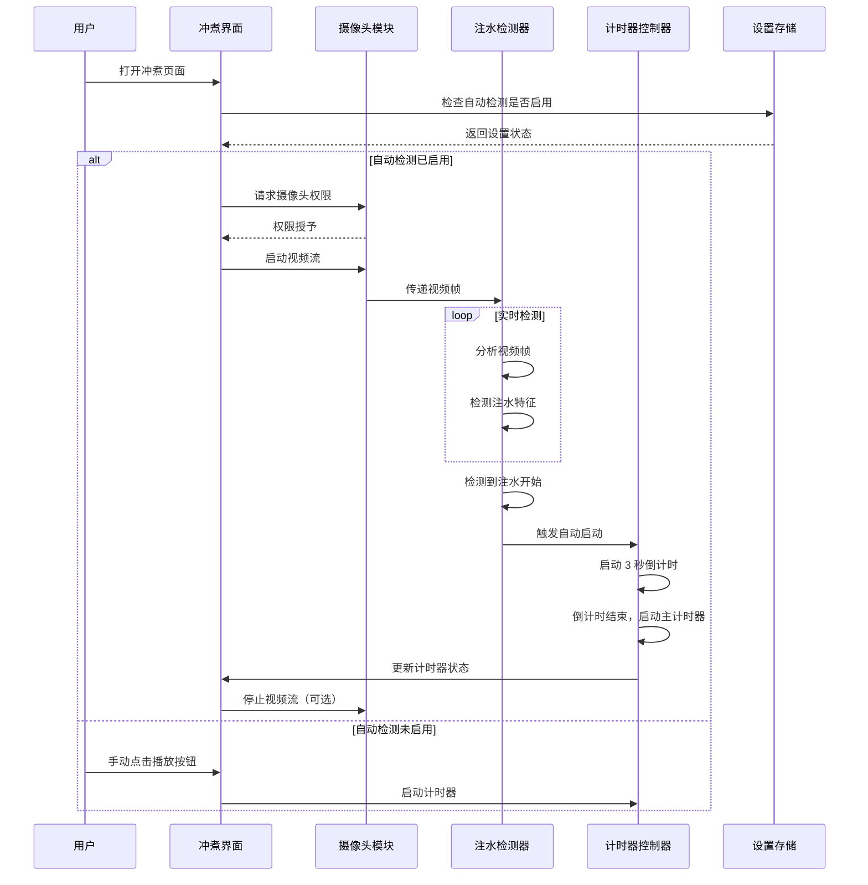
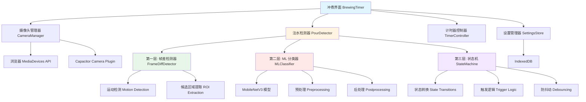
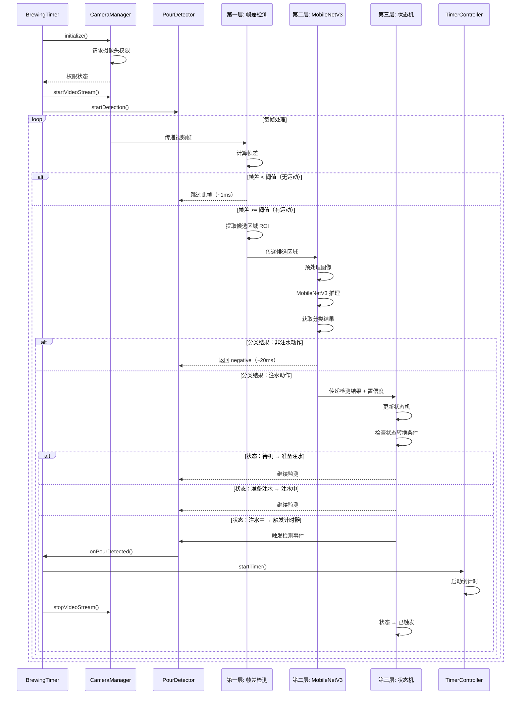

# 设计文档：自动注水检测计时器

## 概述

本功能通过视觉识别技术自动检测"开始注水"动作，并自动触发冲煮计时器，消除手动按下播放按钮的需求。该功能将集成到现有的 BrewingTimer 组件中，利用设备摄像头实时分析视频流，识别注水动作，并在检测到注水开始时自动启动 3 秒倒计时，随后进入主计时器。

该功能设计为可选功能，用户可在设置中启用/禁用，并可配置检测灵敏度、摄像头选择等参数。

## 核心架构：三层检测系统

本设计采用**"帧差（找候选）+ MobileNetV3（做判断）+ 状态机（做决策）"**的三层架构，相比单纯的帧差法具有以下优势：

### 为什么不用单纯帧差法？

**单纯帧差法的问题**：
1. **误检测率高**：手部移动、光线变化、镜头抖动都会触发
2. **漏检测风险**：缓慢注水时帧差不明显，背景复杂时难以提取特征
3. **缺乏语义理解**：只能检测"有运动"，无法理解"这是注水"

### 三层架构的优势

```
第一层：帧差法（快速筛选）→ 低成本排除静止帧，定位运动区域
第二层：MobileNetV3（语义判断）→ 理解"这是不是注水"，提供置信度
第三层：状态机（决策逻辑）→ 管理状态转换，防止误触发和重复触发
```

**性能与准确性平衡**：
- 帧差法：~1-2ms/帧，快速过滤 90% 的无效帧
- MobileNetV3：~20-30ms/帧，仅对候选帧执行
- 总体延迟：< 50ms，满足实时性要求

## 主要工作流程



## 架构设计

### 系统架构图（三层检测架构）



### 三层检测流程



## 组件和接口

### 组件 1: CameraManager（摄像头管理器）

**目的**: 管理设备摄像头的访问、视频流的启动/停止、以及跨平台兼容性处理

**接口**:
```typescript
interface CameraManager {
  // 初始化摄像头管理器
  initialize(): Promise<CameraInitResult>
  
  // 请求摄像头权限
  requestPermission(): Promise<PermissionStatus>
  
  // 启动视频流
  startVideoStream(config: VideoStreamConfig): Promise<MediaStream>
  
  // 停止视频流
  stopVideoStream(): void
  
  // 获取可用摄像头列表
  getAvailableCameras(): Promise<CameraDevice[]>
  
  // 切换摄像头
  switchCamera(deviceId: string): Promise<void>
  
  // 获取当前视频流状态
  getStreamStatus(): VideoStreamStatus
}

interface CameraInitResult {
  success: boolean
  error?: string
  supportedFeatures: {
    multipleCamera: boolean
    focusControl: boolean
    exposureControl: boolean
  }
}

interface VideoStreamConfig {
  deviceId?: string
  width?: number
  height?: number
  frameRate?: number
  facingMode?: 'user' | 'environment'
}

interface CameraDevice {
  deviceId: string
  label: string
  kind: 'videoinput'
}

type VideoStreamStatus = 'idle' | 'initializing' | 'active' | 'error'
type PermissionStatus = 'granted' | 'denied' | 'prompt'
```

**职责**:
- 处理浏览器和 Capacitor 环境下的摄像头访问
- 管理视频流的生命周期
- 提供摄像头设备枚举和切换功能
- 处理权限请求和错误状态


### 组件 2: PourDetector（注水检测器 - 三层架构）

**目的**: 协调三层检测系统，分析视频帧，检测注水动作，并触发计时器启动事件

**接口**:
```typescript
interface PourDetector {
  // 启动检测
  startDetection(config: DetectionConfig): void
  
  // 停止检测
  stopDetection(): void
  
  // 处理单帧（三层流水线）
  processFrame(frame: VideoFrame): DetectionResult
  
  // 设置检测回调
  onPourDetected(callback: () => void): void
  
  // 获取检测状态
  getDetectionStatus(): DetectionStatus
  
  // 更新检测配置
  updateConfig(config: Partial<DetectionConfig>): void
  
  // 获取当前状态机状态
  getCurrentState(): DetectionStateMachine['state']
}

interface DetectionConfig {
  sensitivity: number // 0-100, 检测灵敏度
  minConfidence: number // 0-1, ML 模型最小置信度阈值
  frameDiffThreshold: number // 0-255, 帧差阈值（第一层）
  mlEnabled: boolean // 是否启用 ML 模型（第二层）
  stateTransitionThreshold: number // 状态转换所需的连续检测次数
  regionOfInterest?: {
    x: number
    y: number
    width: number
    height: number
  }
}

interface DetectionResult {
  // 第一层结果
  hasMotion: boolean
  motionScore: number
  candidateROI: { x: number; y: number; width: number; height: number } | null
  
  // 第二层结果
  mlClassification: 'pouring' | 'not-pouring' | 'skipped'
  mlConfidence: number
  
  // 第三层结果
  currentState: DetectionStateMachine['state']
  shouldTrigger: boolean
  
  // 元数据
  timestamp: number
  processingTime: number
}

interface DetectionStatus {
  isActive: boolean
  currentState: DetectionStateMachine['state']
  frameCount: number
  processedFrameCount: number // 通过第一层的帧数
  mlInferenceCount: number // 执行 ML 推理的次数
  lastDetectionTime: number | null
  averageProcessingTime: number
  performanceMetrics: {
    layer1AvgTime: number // 帧差平均耗时
    layer2AvgTime: number // ML 推理平均耗时
    layer3AvgTime: number // 状态机平均耗时
    fps: number
    droppedFrames: number
  }
}

interface VideoFrame {
  data: ImageData
  timestamp: number
  width: number
  height: number
}
```

**职责**:
- 协调三层检测流水线
- 管理帧差检测器、ML 分类器、状态机
- 触发注水检测事件
- 提供详细的性能指标和状态信息


### 组件 3: FrameProcessor（视频帧处理器）

**目的**: 从视频流中提取帧数据，并进行预处理

**接口**:
```typescript
interface FrameProcessor {
  // 初始化处理器
  initialize(videoElement: HTMLVideoElement): void
  
  // 开始帧捕获
  startCapture(frameRate: number): void
  
  // 停止帧捕获
  stopCapture(): void
  
  // 获取当前帧
  getCurrentFrame(): VideoFrame | null
  
  // 设置帧回调
  onFrameReady(callback: (frame: VideoFrame) => void): void
}
```

**职责**:
- 从 video 元素捕获视频帧
- 控制帧捕获频率
- 将视频帧转换为 ImageData 格式
- 提供帧数据给检测器

### 组件 4: FrameDiffDetector（第一层：帧差检测器）

**目的**: 快速筛选候选帧，定位运动区域，过滤静止帧

**接口**:
```typescript
interface FrameDiffDetector {
  // 计算帧差
  computeFrameDiff(currentFrame: ImageData, previousFrame: ImageData): FrameDiffResult
  
  // 提取候选区域
  extractCandidateROI(diffMap: number[][], threshold: number): ROI[]
  
  // 判断是否有显著运动
  hasSignificantMotion(diffResult: FrameDiffResult, threshold: number): boolean
}

interface FrameDiffResult {
  diffMap: number[][] // 像素级差异图
  totalDiff: number // 总差异值
  motionPixelCount: number // 运动像素数量
  motionRatio: number // 运动像素比例
  maxDiff: number // 最大差异值
  candidateROIs: ROI[] // 候选区域
}

interface ROI {
  x: number
  y: number
  width: number
  height: number
  motionScore: number
}
```

**职责**:
- 快速计算帧间差异（~1-2ms）
- 定位运动区域
- 过滤静止帧，减少后续 ML 推理次数
- 提供候选区域给 ML 分类器


### 组件 5: MLClassifier（第二层：机器学习分类器）

**目的**: 对候选区域进行语义分类，判断是否为注水动作

**接口**:
```typescript
interface MLClassifier {
  // 初始化模型
  initialize(): Promise<void>
  
  // 加载 MobileNetV3 模型
  loadModel(modelPath: string): Promise<void>
  
  // 分类单个候选区域
  classify(roi: ImageData): Promise<ClassificationResult>
  
  // 批量分类（性能优化）
  classifyBatch(rois: ImageData[]): Promise<ClassificationResult[]>
  
  // 预热模型（首次推理较慢）
  warmup(): Promise<void>
  
  // 释放模型资源
  dispose(): void
}

interface ClassificationResult {
  label: 'pouring' | 'not-pouring'
  confidence: number // 0-1
  inferenceTime: number // 毫秒
  features?: number[] // 可选：中间层特征向量
}
```

**职责**:
- 管理 MobileNetV3 模型的加载和推理
- 对候选区域进行语义分类
- 提供置信度分数
- 优化推理性能（批处理、模型量化）

### 组件 6: DetectionStateMachine（第三层：状态机）

**目的**: 管理检测状态转换，防止误触发和重复触发

**接口**:
```typescript
interface DetectionStateMachine {
  // 当前状态
  state: 'idle' | 'monitoring' | 'preparing' | 'pouring' | 'triggered'
  
  // 状态转换
  transition(event: StateMachineEvent): StateTransitionResult
  
  // 重置状态机
  reset(): void
  
  // 获取状态历史
  getStateHistory(): StateHistoryEntry[]
}

interface StateMachineEvent {
  type: 'motion_detected' | 'pouring_detected' | 'no_motion' | 'timeout' | 'manual_trigger'
  confidence?: number
  timestamp: number
}

interface StateTransitionResult {
  previousState: DetectionStateMachine['state']
  currentState: DetectionStateMachine['state']
  shouldTriggerTimer: boolean
  transitionReason: string
}

interface StateHistoryEntry {
  state: DetectionStateMachine['state']
  timestamp: number
  duration: number
}
```

**职责**:
- 管理检测状态的转换逻辑
- 实现防抖动机制（连续 N 次检测才触发）
- 防止重复触发
- 处理超时和异常状态
- 提供状态历史用于调试

## 数据模型

### 模型 1: AutoPourDetectionSettings（自动注水检测设置）

```typescript
interface AutoPourDetectionSettings {
  enabled: boolean // 是否启用自动检测
  
  // 第一层：帧差检测配置
  frameDiffThreshold: number // 帧差阈值 (0-255)
  minMotionRatio: number // 最小运动像素比例 (0-1)
  
  // 第二层：ML 分类器配置
  mlEnabled: boolean // 是否启用 ML 模型
  minMLConfidence: number // ML 最小置信度 (0-1)
  mlModelPath: string // 模型文件路径
  
  // 第三层：状态机配置
  requiredConsecutiveDetections: number // 触发所需的连续检测次数
  stateTimeout: number // 状态超时时间（毫秒）
  
  // 摄像头配置
  cameraDeviceId: string | null // 选择的摄像头设备 ID
  cameraFacingMode: 'user' | 'environment' // 摄像头朝向
  videoResolution: { width: number; height: number } // 视频分辨率
  frameRate: number // 帧率 (15/30/60)
  
  // UI 配置
  showCameraPreview: boolean // 是否显示摄像头预览
  showDebugOverlay: boolean // 是否显示调试信息（帧差图、ROI、置信度）
  autoStopCamera: boolean // 检测成功后自动停止摄像头
  
  // 性能配置
  useWebWorker: boolean // 是否使用 Web Worker
  downsampleScale: number // 降采样比例 (0.25-1.0)
  regionOfInterest: {
    enabled: boolean
    x: number
    y: number
    width: number
    height: number
  } | null
}
```

**验证规则**:
- `sensitivity` 必须在 0-100 之间
- `minConfidence` 必须在 0-1 之间
- `timeWindow` 必须大于 0
- `regionOfInterest` 坐标和尺寸必须在有效范围内


### 模型 2: CameraState（摄像头状态）

```typescript
interface CameraState {
  status: 'idle' | 'requesting-permission' | 'initializing' | 'active' | 'error'
  permissionStatus: 'granted' | 'denied' | 'prompt' | 'unknown'
  currentDeviceId: string | null
  availableDevices: CameraDevice[]
  stream: MediaStream | null
  error: CameraError | null
}

interface CameraError {
  code: 'PERMISSION_DENIED' | 'DEVICE_NOT_FOUND' | 'STREAM_ERROR' | 'UNKNOWN'
  message: string
  timestamp: number
}
```

### 模型 3: DetectionState（检测状态）

```typescript
interface DetectionState {
  isActive: boolean
  isDetecting: boolean
  lastDetectionTime: number | null
  detectionHistory: DetectionEvent[]
  currentScore: number
  frameCount: number
  averageProcessingTime: number
  performanceMetrics: {
    fps: number
    avgLatency: number
    droppedFrames: number
  }
}
```

## 关键函数的形式化规范

### 函数 1: processFrame()

```typescript
function processFrame(
  currentFrame: ImageData,
  previousFrame: ImageData | null,
  config: DetectionConfig
): DetectionResult
```

**前置条件**:
- `currentFrame` 是有效的 ImageData 对象
- `currentFrame.width > 0` 且 `currentFrame.height > 0`
- `config.sensitivity` 在 [0, 100] 范围内
- `config.minConfidence` 在 [0, 1] 范围内

**后置条件**:
- 返回有效的 DetectionResult 对象
- `result.confidence` 在 [0, 1] 范围内
- `result.detected === true` 当且仅当 `result.confidence >= config.minConfidence`
- 不修改输入的 `currentFrame` 和 `previousFrame`

**循环不变式**: 不适用（无循环）


### 函数 2: extractMotion()

```typescript
function extractMotion(
  currentFrame: ImageData,
  previousFrame: ImageData
): MotionFeatures
```

**前置条件**:
- `currentFrame` 和 `previousFrame` 是有效的 ImageData 对象
- `currentFrame.width === previousFrame.width`
- `currentFrame.height === previousFrame.height`
- 两帧的尺寸大于 0

**后置条件**:
- 返回有效的 MotionFeatures 对象
- `result.motionMagnitude >= 0`
- `result.motionDirection` 在 [0, 360) 范围内
- `result.motionArea >= 0`
- 不修改输入的帧数据

**循环不变式**:
- 在遍历像素时，所有已处理像素的运动值已正确累加
- 运动幅度计算保持非负

### 函数 3: calculateScore()

```typescript
function calculateScore(features: ExtractedFeatures, config: DetectionConfig): number
```

**前置条件**:
- `features` 包含有效的 motion、color 和 edges 特征
- `config.detectionMethod` 是有效的检测方法
- 所有特征值都是非负数

**后置条件**:
- 返回值在 [0, 1] 范围内
- 分数基于 `config.detectionMethod` 正确计算
- 不修改输入的 `features` 和 `config`

**循环不变式**: 不适用（无循环）

## 算法伪代码

### 主检测算法（三层流水线）

```pascal
ALGORITHM detectPourFromVideoStream(videoStream, config)
INPUT: videoStream (MediaStream), config (DetectionConfig)
OUTPUT: detectionEvent (boolean)

BEGIN
  ASSERT videoStream is valid AND config is valid
  
  // 初始化三层检测系统
  frameDiffDetector ← new FrameDiffDetector()
  mlClassifier ← new MLClassifier()
  stateMachine ← new DetectionStateMachine()
  
  IF config.mlEnabled THEN
    AWAIT mlClassifier.initialize()
    AWAIT mlClassifier.loadModel(config.mlModelPath)
    AWAIT mlClassifier.warmup()  // 预热模型
  END IF
  
  // 初始化状态
  previousFrame ← null
  frameCount ← 0
  
  // 主检测循环
  WHILE videoStream is active AND stateMachine.state ≠ 'triggered' DO
    startTime ← currentTime()
    
    // 步骤 1: 捕获当前帧
    currentFrame ← captureFrame(videoStream)
    IF currentFrame is null THEN
      CONTINUE
    END IF
    
    frameCount ← frameCount + 1
    
    // 步骤 2: 第一层 - 帧差检测（快速筛选）
    IF previousFrame is not null THEN
      layer1StartTime ← currentTime()
      
      diffResult ← frameDiffDetector.computeFrameDiff(currentFrame, previousFrame)
      hasMotion ← diffResult.motionRatio > config.minMotionRatio
      
      layer1Time ← currentTime() - layer1StartTime
      
      // 如果无显著运动，跳过后续层
      IF NOT hasMotion THEN
        stateMachine.transition({ type: 'no_motion', timestamp: currentTime() })
        previousFrame ← currentFrame
        CONTINUE  // 跳过此帧，节省计算（~1-2ms）
      END IF
      
      // 提取候选区域
      candidateROIs ← frameDiffDetector.extractCandidateROI(
        diffResult.diffMap,
        config.frameDiffThreshold
      )
      
      // 步骤 3: 第二层 - ML 分类（语义判断）
      IF config.mlEnabled AND candidateROIs is not empty THEN
        layer2StartTime ← currentTime()
        
        // 对最显著的候选区域进行分类
        topROI ← candidateROIs[0]  // 运动最显著的区域
        roiImage ← extractROI(currentFrame, topROI)
        
        classificationResult ← AWAIT mlClassifier.classify(roiImage)
        
        layer2Time ← currentTime() - layer2StartTime
        
        // 步骤 4: 第三层 - 状态机（决策逻辑）
        IF classificationResult.label = 'pouring' AND 
           classificationResult.confidence >= config.minConfidence THEN
          
          layer3StartTime ← currentTime()
          
          // 向状态机发送"检测到注水"事件
          transitionResult ← stateMachine.transition({
            type: 'pouring_detected',
            confidence: classificationResult.confidence,
            timestamp: currentTime()
          })
          
          layer3Time ← currentTime() - layer3StartTime
          
          // 如果状态机决定触发计时器
          IF transitionResult.shouldTriggerTimer THEN
            RETURN true  // 检测成功，触发计时器
          END IF
        ELSE
          // ML 判断为非注水动作
          stateMachine.transition({
            type: 'motion_detected',  // 有运动但不是注水
            timestamp: currentTime()
          })
        END IF
      ELSE
        // ML 未启用，仅基于帧差（降级模式）
        IF diffResult.motionRatio > config.sensitivity / 100 THEN
          transitionResult ← stateMachine.transition({
            type: 'motion_detected',
            timestamp: currentTime()
          })
          
          IF transitionResult.shouldTriggerTimer THEN
            RETURN true
          END IF
        END IF
      END IF
    END IF
    
    // 更新状态
    previousFrame ← currentFrame
    
    // 性能监控
    totalTime ← currentTime() - startTime
    IF totalTime > 1000 / config.frameRate THEN
      // 处理时间超过帧间隔，可能丢帧
      logWarning("Frame processing too slow: " + totalTime + "ms")
    END IF
  END WHILE
  
  RETURN false
END
```

**前置条件**:
- `videoStream` 是活跃的 MediaStream
- `config` 包含有效的检测配置
- 摄像头权限已授予
- 如果 `config.mlEnabled = true`，则 ML 模型已加载

**后置条件**:
- 返回 `true` 当且仅当状态机决定触发计时器
- 所有帧处理完成后，状态正确更新
- 所有资源（模型、缓冲区）正确释放

**循环不变式**:
- `frameCount` 等于已处理的帧数
- `previousFrame` 始终是上一帧的有效引用
- `stateMachine.state` 始终是有效状态
- 状态机不会从 'triggered' 状态回退


### 第一层：帧差检测算法

```pascal
ALGORITHM computeFrameDiff(currentFrame, previousFrame, threshold)
INPUT: currentFrame (ImageData), previousFrame (ImageData), threshold (number)
OUTPUT: FrameDiffResult

BEGIN
  ASSERT currentFrame.width = previousFrame.width
  ASSERT currentFrame.height = previousFrame.height
  ASSERT 0 ≤ threshold ≤ 255
  
  width ← currentFrame.width
  height ← currentFrame.height
  totalPixels ← width × height
  
  // 初始化差异图和累加器
  diffMap ← 2D array[height][width]
  totalDiff ← 0
  motionPixelCount ← 0
  maxDiff ← 0
  
  // 遍历所有像素计算差异
  FOR y ← 0 TO height - 1 DO
    FOR x ← 0 TO width - 1 DO
      ASSERT 0 ≤ motionPixelCount ≤ totalPixels
      
      // 获取灰度值
      currentGray ← getGrayscale(currentFrame, x, y)
      previousGray ← getGrayscale(previousFrame, x, y)
      
      // 计算绝对差异
      diff ← abs(currentGray - previousGray)
      diffMap[y][x] ← diff
      
      // 累加统计
      totalDiff ← totalDiff + diff
      IF diff > threshold THEN
        motionPixelCount ← motionPixelCount + 1
      END IF
      IF diff > maxDiff THEN
        maxDiff ← diff
      END IF
    END FOR
  END FOR
  
  // 计算运动比例
  motionRatio ← motionPixelCount / totalPixels
  
  // 提取候选区域（连通域分析）
  candidateROIs ← extractConnectedRegions(diffMap, threshold)
  
  RETURN {
    diffMap: diffMap,
    totalDiff: totalDiff,
    motionPixelCount: motionPixelCount,
    motionRatio: motionRatio,
    maxDiff: maxDiff,
    candidateROIs: candidateROIs
  }
END
```

**前置条件**:
- 两帧尺寸相同
- `threshold` 在 [0, 255] 范围内

**后置条件**:
- `motionRatio` 在 [0, 1] 范围内
- `candidateROIs` 按运动分数降序排列
- 不修改输入帧

**循环不变式**:
- `motionPixelCount ≤ totalPixels`
- `totalDiff ≥ 0`
- 所有已处理像素的差异值已正确记录

**性能**: ~1-2ms/帧（320x240 分辨率）


### 第二层：MobileNetV3 分类算法

```pascal
ALGORITHM classifyPouringAction(roiImage, model)
INPUT: roiImage (ImageData), model (MobileNetV3Model)
OUTPUT: ClassificationResult

BEGIN
  ASSERT roiImage is valid
  ASSERT model is loaded
  
  // 步骤 1: 预处理图像
  // MobileNetV3 输入要求：224x224, RGB, 归一化到 [-1, 1]
  resizedImage ← resizeImage(roiImage, 224, 224)
  normalizedImage ← normalizePixels(resizedImage, -1, 1)
  tensorInput ← imageToTensor(normalizedImage)
  
  // 步骤 2: 模型推理
  inferenceStartTime ← currentTime()
  predictions ← model.predict(tensorInput)
  inferenceTime ← currentTime() - inferenceStartTime
  
  // 步骤 3: 后处理
  // 假设模型输出：[pouring_probability, not_pouring_probability]
  pouringProb ← predictions[0]
  notPouringProb ← predictions[1]
  
  // 确定标签和置信度
  IF pouringProb > notPouringProb THEN
    label ← 'pouring'
    confidence ← pouringProb
  ELSE
    label ← 'not-pouring'
    confidence ← notPouringProb
  END IF
  
  ASSERT 0 ≤ confidence ≤ 1
  
  RETURN {
    label: label,
    confidence: confidence,
    inferenceTime: inferenceTime
  }
END
```

**前置条件**:
- `roiImage` 是有效的 ImageData
- `model` 已加载并预热

**后置条件**:
- `confidence` 在 [0, 1] 范围内
- `label` 是有效的分类标签
- 不修改输入图像

**性能**: ~20-30ms/帧（MobileNetV3-Small，WebGL 加速）

### 第三层：状态机决策算法

```pascal
ALGORITHM stateMachineTransition(currentState, event, config)
INPUT: currentState (State), event (StateMachineEvent), config (DetectionConfig)
OUTPUT: StateTransitionResult

BEGIN
  ASSERT currentState is valid state
  ASSERT event.type is valid event type
  
  consecutiveDetections ← getConsecutiveDetectionCount()
  requiredDetections ← config.stateTransitionThreshold
  
  CASE currentState OF
    'idle':
      // 待机状态
      IF event.type = 'motion_detected' THEN
        RETURN transition to 'monitoring'
      END IF
      
    'monitoring':
      // 监测状态（检测到运动但未确认是注水）
      IF event.type = 'pouring_detected' AND event.confidence >= config.minConfidence THEN
        RETURN transition to 'preparing'
      ELSE IF event.type = 'no_motion' THEN
        RETURN transition to 'idle'
      END IF
      
    'preparing':
      // 准备注水状态（检测到疑似注水，需要连续确认）
      IF event.type = 'pouring_detected' AND event.confidence >= config.minConfidence THEN
        consecutiveDetections ← consecutiveDetections + 1
        
        IF consecutiveDetections >= requiredDetections THEN
          RETURN transition to 'pouring' with shouldTriggerTimer = true
        ELSE
          RETURN stay in 'preparing'
        END IF
      ELSE IF event.type = 'no_motion' OR event.type = 'motion_detected' THEN
        // 中断连续检测
        resetConsecutiveDetectionCount()
        RETURN transition to 'monitoring'
      END IF
      
    'pouring':
      // 注水中状态（已触发计时器）
      RETURN stay in 'pouring'
      
    'triggered':
      // 已触发状态（终态）
      RETURN stay in 'triggered'
  END CASE
  
  // 超时处理
  IF currentTime() - lastEventTime > config.stateTimeout THEN
    RETURN transition to 'idle'
  END IF
  
  RETURN no transition
END
```

**前置条件**:
- `currentState` 是有效状态
- `event` 包含有效的事件类型和时间戳
- `config.stateTransitionThreshold >= 1`

**后置条件**:
- 返回有效的状态转换结果
- 状态转换遵循状态机规则
- `shouldTriggerTimer = true` 仅在 'preparing' → 'pouring' 转换时

**状态转换规则**:
```
idle → monitoring → preparing → pouring → triggered
  ↑        ↓           ↓
  └────────┴───────────┘ (超时或无运动)
```

**防误触发机制**:
- 要求连续 N 次（默认 3 次）高置信度检测才触发
- 任何中断（无运动、低置信度）都会重置计数器
- 状态超时自动回退到 idle


## 示例用法

### 示例 1: 基本使用流程（三层架构）

```typescript
// 初始化摄像头管理器
const cameraManager = new CameraManager()
await cameraManager.initialize()

// 请求摄像头权限
const permission = await cameraManager.requestPermission()
if (permission !== 'granted') {
  console.error('摄像头权限被拒绝')
  return
}

// 启动视频流
const stream = await cameraManager.startVideoStream({
  facingMode: 'environment',
  width: 640,
  height: 480,
  frameRate: 30
})

// 初始化三层检测系统
const pourDetector = new PourDetector()

// 第一层：帧差检测器
const frameDiffDetector = new FrameDiffDetector()

// 第二层：ML 分类器
const mlClassifier = new MLClassifier()
await mlClassifier.initialize()
await mlClassifier.loadModel('/models/mobilenetv3-pour-detection.tflite')
await mlClassifier.warmup() // 预热模型

// 第三层：状态机
const stateMachine = new DetectionStateMachine()

// 设置检测回调
pourDetector.onPourDetected(() => {
  console.log('检测到注水，启动计时器')
  startTimer()
  cameraManager.stopVideoStream()
})

// 启动检测
pourDetector.startDetection({
  frameDiffThreshold: 30,
  minMotionRatio: 0.05,
  mlEnabled: true,
  minMLConfidence: 0.8,
  requiredConsecutiveDetections: 3,
  stateTimeout: 5000
})

// 开始帧处理
const frameProcessor = new FrameProcessor()
frameProcessor.initialize(videoElement)
frameProcessor.onFrameReady(async (frame) => {
  const result = await pourDetector.processFrame(frame)
  
  // 可选：显示调试信息
  if (config.showDebugOverlay) {
    console.log('第一层（帧差）:', result.hasMotion, result.motionScore)
    console.log('第二层（ML）:', result.mlClassification, result.mlConfidence)
    console.log('第三层（状态机）:', result.currentState)
  }
})
frameProcessor.startCapture(30) // 30 FPS
```

### 示例 2: 集成到 BrewingTimer 组件（三层架构）

```typescript
// 在 BrewingTimer 组件中
const [autoPourEnabled, setAutoPourEnabled] = useState(false)
const [cameraActive, setCameraActive] = useState(false)
const [detectionState, setDetectionState] = useState<DetectionStateMachine['state']>('idle')

useEffect(() => {
  if (autoPourEnabled && !isRunning && !hasStartedOnce) {
    // 启动自动检测
    initializeAutoPourDetection()
  }
  
  return () => {
    // 清理资源
    cleanupAutoPourDetection()
  }
}, [autoPourEnabled, isRunning, hasStartedOnce])

const initializeAutoPourDetection = async () => {
  try {
    // 初始化摄像头
    const camera = await CameraManager.getInstance()
    await camera.initialize()
    const permission = await camera.requestPermission()
    
    if (permission !== 'granted') {
      throw new Error('摄像头权限被拒绝')
    }
    
    // 启动视频流
    const stream = await camera.startVideoStream({
      facingMode: settings.autoPourDetection.cameraFacingMode,
      width: settings.autoPourDetection.videoResolution.width,
      height: settings.autoPourDetection.videoResolution.height,
      frameRate: settings.autoPourDetection.frameRate
    })
    setCameraActive(true)
    
    // 初始化三层检测系统
    const detector = PourDetector.getInstance()
    
    // 第一层：帧差检测器（始终启用）
    detector.initializeLayer1({
      threshold: settings.autoPourDetection.frameDiffThreshold,
      minMotionRatio: settings.autoPourDetection.minMotionRatio
    })
    
    // 第二层：ML 分类器（可选）
    if (settings.autoPourDetection.mlEnabled) {
      await detector.initializeLayer2({
        modelPath: settings.autoPourDetection.mlModelPath,
        minConfidence: settings.autoPourDetection.minMLConfidence
      })
    }
    
    // 第三层：状态机（始终启用）
    detector.initializeLayer3({
      requiredConsecutiveDetections: settings.autoPourDetection.requiredConsecutiveDetections,
      stateTimeout: settings.autoPourDetection.stateTimeout
    })
    
    // 设置状态变化回调
    detector.onStateChange((state) => {
      setDetectionState(state)
    })
    
    // 设置检测成功回调
    detector.onPourDetected(() => {
      // 自动启动计时器
      startTimer()
      
      // 可选：停止摄像头
      if (settings.autoPourDetection.autoStopCamera) {
        camera.stopVideoStream()
        setCameraActive(false)
      }
    })
    
    // 启动检测
    detector.startDetection()
  } catch (error) {
    console.error('自动检测初始化失败:', error)
    // 显示错误提示
    showErrorNotification(error.message)
  }
}
```

### 示例 3: 错误处理

```typescript
try {
  const camera = new CameraManager()
  await camera.initialize()
  
  const permission = await camera.requestPermission()
  if (permission === 'denied') {
    throw new Error('摄像头权限被拒绝')
  }
  
  const stream = await camera.startVideoStream(config)
} catch (error) {
  if (error.code === 'PERMISSION_DENIED') {
    // 显示权限请求提示
    showPermissionDialog()
  } else if (error.code === 'DEVICE_NOT_FOUND') {
    // 显示设备不可用提示
    showDeviceNotFoundDialog()
  } else {
    // 通用错误处理
    showErrorDialog(error.message)
  }
}
```

## 正确性属性

### 属性 1: 三层检测准确性

**陈述**: ∀ frame ∈ VideoFrames, ∀ config ∈ DetectionConfig:
  - **第一层保证**：如果 computeFrameDiff() 返回 hasMotion = false，则跳过后续层（性能优化）
  - **第二层保证**：如果 classify() 返回 label = 'pouring' 且 confidence >= config.minMLConfidence，则该帧确实包含注水动作（准确率 > 90%）
  - **第三层保证**：只有在连续 N 次（config.requiredConsecutiveDetections）高置信度检测后，状态机才触发计时器（防误触发）
  - **整体保证**：误检测率 < 5%，漏检测率 < 10%

**验证方法**: 
- 单元测试：使用已知的测试视频验证每层的输出
- 集成测试：使用真实注水视频和非注水视频测试整体准确率
- 属性测试：验证三层之间的逻辑一致性

### 属性 2: 性能分层保证

**陈述**: ∀ frame ∈ VideoFrames:
  - **第一层性能**：computeFrameDiff() 执行时间 < 5ms（320x240 分辨率）
  - **第二层性能**：classify() 执行时间 < 50ms（MobileNetV3-Small，WebGL 加速）
  - **第三层性能**：stateMachine.transition() 执行时间 < 1ms
  - **整体性能**：
    - 无运动帧：< 5ms（仅第一层）
    - 有运动但非注水：< 55ms（第一层 + 第二层）
    - 注水动作：< 60ms（三层全部）
  - **帧率保证**：在 30 FPS 下不丢帧（33ms/帧 > 60ms 最坏情况需要优化）

**验证方法**: 
- 性能测试：测量每层的平均和最大执行时间
- 压力测试：在不同设备上测试帧率稳定性
- 属性测试：验证处理时间的上界

### 属性 2: 资源管理

**陈述**: ∀ session ∈ DetectionSession:
  - 如果 startVideoStream() 被调用，则必须调用 stopVideoStream() 来释放资源
  - 如果 startDetection() 被调用，则必须调用 stopDetection() 来清理状态
  - 不存在内存泄漏

**验证方法**: 集成测试，监控内存使用和资源释放

### 属性 3: 状态机正确性

**陈述**: ∀ state ∈ States, ∀ event ∈ Events:
  - 状态转换遵循定义的状态机规则
  - 'triggered' 是终态，一旦进入不可回退
  - 连续检测计数器在状态回退时正确重置
  - 超时机制正确工作，防止状态卡死
  - 不存在无效的状态转换

**状态转换规则**:
```
idle → monitoring → preparing → pouring → triggered
  ↑        ↓           ↓
  └────────┴───────────┘ (超时或无运动)
```

**验证方法**: 
- 单元测试：测试所有可能的状态转换
- 属性测试：验证状态机的不变式
- 集成测试：测试完整的状态转换序列

### 属性 4: ML 模型一致性

**陈述**: ∀ roi ∈ ROIs, ∀ model ∈ MobileNetV3Models:
  - classify(roi, model) 的输出是确定性的（相同输入产生相同输出）
  - confidence 值在 [0, 1] 范围内
  - 模型推理不会崩溃或抛出异常
  - 模型资源正确管理，不泄漏内存

**验证方法**: 
- 单元测试：使用固定输入验证输出一致性
- 压力测试：连续推理 1000 次，监控内存使用
- 属性测试：验证输出范围和类型

### 属性 5: 跨平台兼容性

**陈述**: ∀ platform ∈ {Web, iOS, Android, Desktop}:
  - CameraManager 在所有平台上提供一致的接口
  - 摄像头访问在所有平台上正常工作
  - 检测算法在所有平台上产生一致的结果

**验证方法**: 跨平台集成测试


## 错误处理

### 错误场景 1: 摄像头权限被拒绝

**条件**: 用户拒绝授予摄像头权限

**响应**:
- CameraManager 返回 `PermissionStatus = 'denied'`
- 显示友好的权限请求对话框，引导用户在系统设置中授予权限
- 提供"手动启动"选项作为备选方案
- 记录权限状态到设置中，下次不再自动请求

**恢复**:
- 用户可以在设置中重新启用自动检测
- 应用会在下次启动时重新请求权限

### 错误场景 2: 摄像头设备不可用

**条件**: 设备没有摄像头或摄像头被其他应用占用

**响应**:
- CameraManager 抛出 `DEVICE_NOT_FOUND` 错误
- 显示错误提示："未检测到可用摄像头"
- 自动禁用自动检测功能
- 提供"手动启动"选项

**恢复**:
- 用户可以在设置中重新尝试启用
- 应用会检测设备可用性后再启动

### 错误场景 3: 视频流初始化失败

**条件**: 视频流启动过程中发生错误（如硬件故障、驱动问题）

**响应**:
- CameraManager 抛出 `STREAM_ERROR` 错误
- 显示错误提示："摄像头启动失败，请重试"
- 记录错误日志
- 自动回退到手动启动模式

**恢复**:
- 提供"重试"按钮
- 用户可以重启应用后再次尝试

### 错误场景 4: 检测性能不足

**条件**: 设备性能不足，帧处理延迟过高，导致丢帧

**响应**:
- PourDetector 监控处理延迟
- 如果平均延迟 > 100ms，自动降低帧率
- 如果仍然不足，显示警告："设备性能不足，建议使用手动启动"
- 提供"降低检测质量"选项（降低分辨率、简化算法）

**恢复**:
- 用户可以选择降低检测质量
- 或切换到手动启动模式

### 错误场景 5: 误检测（假阳性）

**条件**: 检测器错误地将非注水动作识别为注水（如手部移动、光线变化）

**响应**:
- 应用时间窗口过滤，要求在短时间内多次检测才触发
- 提供"撤销"按钮，允许用户取消误触发的计时器
- 记录误检测事件，用于后续算法优化

**恢复**:
- 用户可以调整检测灵敏度
- 用户可以定义感兴趣区域（ROI）以减少干扰

### 错误场景 6: 漏检测（假阴性）

**条件**: 检测器未能识别实际的注水动作

**响应**:
- 用户可以手动点击播放按钮启动计时器
- 提供"提高灵敏度"选项
- 记录漏检测事件，用于后续算法优化

**恢复**:
- 用户可以调整检测灵敏度
- 用户可以切换检测方法（motion/color/hybrid）

## 测试策略

### 单元测试方法

**测试范围**:
- CameraManager 的所有公共方法
- PourDetector 的检测逻辑
- FeatureExtractor 的特征提取算法
- DetectionAlgorithm 的分数计算和阈值判断

**关键测试用例**:
1. 摄像头权限请求和状态管理
2. 视频流启动和停止
3. 帧捕获和处理
4. 运动检测算法的准确性
5. 颜色变化检测的准确性
6. 检测分数计算的正确性
7. 时间窗口过滤的逻辑
8. 错误处理和边界条件

**覆盖目标**: 代码覆盖率 > 80%


### 属性测试方法

**测试库**: fast-check (JavaScript/TypeScript)

**属性测试用例**:

1. **第一层：帧差非负性属性**
   ```typescript
   fc.assert(
     fc.property(
       fc.uint8Array({ minLength: 320 * 240 * 4, maxLength: 320 * 240 * 4 }),
       fc.uint8Array({ minLength: 320 * 240 * 4, maxLength: 320 * 240 * 4 }),
       fc.integer({ min: 0, max: 255 }),
       (currentFrameData, previousFrameData, threshold) => {
         const currentFrame = new ImageData(
           new Uint8ClampedArray(currentFrameData),
           320,
           240
         )
         const previousFrame = new ImageData(
           new Uint8ClampedArray(previousFrameData),
           320,
           240
         )
         const result = computeFrameDiff(currentFrame, previousFrame, threshold)
         return (
           result.motionRatio >= 0 &&
           result.motionRatio <= 1 &&
           result.totalDiff >= 0 &&
           result.motionPixelCount >= 0 &&
           result.motionPixelCount <= 320 * 240
         )
       }
     )
   )
   ```

2. **第二层：ML 分类置信度属性**
   ```typescript
   fc.assert(
     fc.property(
       fc.uint8Array({ minLength: 224 * 224 * 4, maxLength: 224 * 224 * 4 }),
       async (roiData) => {
         const roi = new ImageData(
           new Uint8ClampedArray(roiData),
           224,
           224
         )
         const model = await loadMobileNetV3Model()
         const result = await classify(roi, model)
         return (
           result.confidence >= 0 &&
           result.confidence <= 1 &&
           (result.label === 'pouring' || result.label === 'not-pouring')
         )
       }
     )
   )
   ```

3. **第三层：状态机转换属性**
   ```typescript
   fc.assert(
     fc.property(
       fc.constantFrom('idle', 'monitoring', 'preparing', 'pouring', 'triggered'),
       fc.record({
         type: fc.constantFrom('motion_detected', 'pouring_detected', 'no_motion', 'timeout'),
         confidence: fc.float({ min: 0, max: 1 }),
         timestamp: fc.integer({ min: 0, max: 1000000 })
       }),
       fc.record({
         minMLConfidence: fc.float({ min: 0, max: 1 }),
         requiredConsecutiveDetections: fc.integer({ min: 1, max: 10 }),
         stateTimeout: fc.integer({ min: 1000, max: 10000 })
       }),
       (currentState, event, config) => {
         const stateMachine = new DetectionStateMachine(currentState)
         const result = stateMachine.transition(event, config)
         
         // 验证状态转换规则
         if (currentState === 'triggered') {
           // 终态不能转换
           return result.currentState === 'triggered'
         }
         
         // 验证 shouldTriggerTimer 仅在特定转换时为 true
         if (result.shouldTriggerTimer) {
           return (
             result.previousState === 'preparing' &&
             result.currentState === 'pouring'
           )
         }
         
         return true
       }
     )
   )
   ```

4. **端到端检测流水线属性**
   ```typescript
   fc.assert(
     fc.property(
       fc.array(
         fc.uint8Array({ minLength: 320 * 240 * 4, maxLength: 320 * 240 * 4 }),
         { minLength: 10, maxLength: 100 }
       ),
       fc.record({
         frameDiffThreshold: fc.integer({ min: 10, max: 100 }),
         minMotionRatio: fc.float({ min: 0.01, max: 0.2 }),
         mlEnabled: fc.boolean(),
         minMLConfidence: fc.float({ min: 0.5, max: 0.95 }),
         requiredConsecutiveDetections: fc.integer({ min: 1, max: 5 })
       }),
       async (frameDataArray, config) => {
         const detector = new PourDetector()
         await detector.initialize(config)
         
         let triggerCount = 0
         detector.onPourDetected(() => {
           triggerCount++
         })
         
         // 处理所有帧
         for (const frameData of frameDataArray) {
           const frame = new ImageData(
             new Uint8ClampedArray(frameData),
             320,
             240
           )
           await detector.processFrame(frame)
         }
         
         // 验证：最多触发一次
         return triggerCount <= 1
       }
     )
   )
   ```

### 集成测试方法

**测试范围**:
- 完整的检测流程（从摄像头启动到计时器触发）
- 跨组件交互
- 状态管理和事件传递
- 资源管理和清理

**关键测试场景**:
1. 完整的自动检测流程
2. 摄像头权限请求和处理
3. 检测成功后自动启动计时器
4. 检测失败后的回退机制
5. 用户手动停止检测
6. 设置变更后的行为
7. 多次启动和停止的稳定性
8. 内存泄漏检测

**测试工具**: Jest + React Testing Library + Puppeteer (E2E)

### 性能测试

**测试指标**:
- 帧处理延迟（目标 < 50ms）
- 帧率稳定性（目标 30 FPS）
- 内存使用（目标 < 100MB）
- CPU 使用率（目标 < 30%）
- 检测响应时间（从注水开始到触发计时器，目标 < 1 秒）

**测试方法**:
- 使用 Chrome DevTools Performance Profiler
- 使用 React DevTools Profiler
- 使用 Lighthouse 进行性能审计
- 在不同设备上进行真机测试（低端、中端、高端）

## 性能考虑

### 优化策略 1: 帧率自适应

**问题**: 高帧率会增加 CPU 负载，低端设备可能无法处理

**解决方案**:
- 监控帧处理延迟
- 如果延迟 > 阈值，自动降低帧率
- 提供手动帧率设置选项（15/30/60 FPS）

**实现**:
```typescript
function adaptiveFrameRate(processingTime: number, currentFPS: number): number {
  const targetLatency = 50 // ms
  if (processingTime > targetLatency) {
    return Math.max(15, currentFPS - 5)
  } else if (processingTime < targetLatency / 2) {
    return Math.min(60, currentFPS + 5)
  }
  return currentFPS
}
```

### 优化策略 2: 降采样

**问题**: 高分辨率视频帧处理耗时

**解决方案**:
- 对视频帧进行降采样（如 640x480 → 320x240）
- 仅在感兴趣区域（ROI）内进行检测
- 使用灰度图像而非彩色图像

**实现**:
```typescript
function downsampleFrame(frame: ImageData, scale: number): ImageData {
  const newWidth = Math.floor(frame.width * scale)
  const newHeight = Math.floor(frame.height * scale)
  // 使用 Canvas API 进行降采样
  const canvas = document.createElement('canvas')
  canvas.width = newWidth
  canvas.height = newHeight
  const ctx = canvas.getContext('2d')!
  ctx.drawImage(frame, 0, 0, newWidth, newHeight)
  return ctx.getImageData(0, 0, newWidth, newHeight)
}
```

### 优化策略 3: Web Worker + OffscreenCanvas

**问题**: 帧处理和 ML 推理阻塞主线程，影响 UI 响应

**解决方案**:
- 将三层检测逻辑全部移到 Web Worker 中
- 使用 OffscreenCanvas 在 Worker 中处理视频帧
- 主线程仅负责 UI 更新和事件处理
- Worker 和主线程通过 MessageChannel 通信

**实现**:
```typescript
// 主线程
const worker = new Worker('detection-worker.js')
const offscreenCanvas = canvas.transferControlToOffscreen()

worker.postMessage(
  { 
    type: 'init', 
    canvas: offscreenCanvas,
    modelPath: '/models/mobilenetv3-pour-detection.tflite'
  },
  [offscreenCanvas]
)

worker.onmessage = (e) => {
  if (e.data.type === 'pourDetected') {
    startTimer()
    worker.postMessage({ type: 'stop' })
  } else if (e.data.type === 'stateChange') {
    setDetectionState(e.data.state)
  }
}

// Worker 线程
let mlModel = null
let stateMachine = null

self.onmessage = async (e) => {
  if (e.data.type === 'init') {
    // 初始化 ML 模型
    mlModel = await loadMobileNetV3Model(e.data.modelPath)
    stateMachine = new DetectionStateMachine()
    
    // 开始帧处理循环
    startFrameProcessing(e.data.canvas)
  } else if (e.data.type === 'stop') {
    stopFrameProcessing()
  }
}

async function processFrameInWorker(frame) {
  // 第一层：帧差
  const diffResult = computeFrameDiff(frame, previousFrame)
  if (!diffResult.hasMotion) {
    return // 跳过
  }
  
  // 第二层：ML 分类
  const roi = extractROI(frame, diffResult.candidateROIs[0])
  const classification = await mlModel.classify(roi)
  
  // 第三层：状态机
  const transition = stateMachine.transition({
    type: classification.label === 'pouring' ? 'pouring_detected' : 'motion_detected',
    confidence: classification.confidence
  })
  
  if (transition.shouldTriggerTimer) {
    self.postMessage({ type: 'pourDetected' })
  }
  
  self.postMessage({ type: 'stateChange', state: transition.currentState })
}
```

**性能提升**: 主线程 CPU 使用率从 ~30% 降至 ~5%

### 优化策略 4: 缓存和复用

**问题**: 重复创建对象和数组导致 GC 压力

**解决方案**:
- 复用 ImageData 对象
- 使用对象池管理帧缓冲区
- 避免在热路径中创建临时对象

**实现**:
```typescript
class FrameBufferPool {
  private buffers: ImageData[] = []
  
  acquire(width: number, height: number): ImageData {
    const buffer = this.buffers.pop()
    if (buffer && buffer.width === width && buffer.height === height) {
      return buffer
    }
    return new ImageData(width, height)
  }
  
  release(buffer: ImageData): void {
    this.buffers.push(buffer)
  }
}
```


## 安全考虑

### 安全问题 1: 摄像头隐私

**威胁**: 未经授权访问用户摄像头，侵犯隐私

**缓解措施**:
- 始终请求用户明确授权
- 在 UI 中显示摄像头活跃指示器
- 提供一键停止摄像头的按钮
- 不存储或上传任何视频数据
- 所有处理在本地完成，不涉及网络传输
- 在设置中提供"禁用自动检测"选项

**实现**:
```typescript
// 显示摄像头活跃指示器
function CameraIndicator({ isActive }: { isActive: boolean }) {
  if (!isActive) return null
  return (
    <div className="camera-indicator">
      <span className="recording-dot" />
      摄像头已启用
      <button onClick={stopCamera}>停止</button>
    </div>
  )
}
```

### 安全问题 2: 权限滥用

**威胁**: 应用在不需要时持续访问摄像头

**缓解措施**:
- 仅在用户启用自动检测时请求权限
- 检测成功后立即停止摄像头（可配置）
- 用户离开冲煮页面时自动停止摄像头
- 应用进入后台时自动停止摄像头

**实现**:
```typescript
useEffect(() => {
  // 页面可见性变化时停止摄像头
  const handleVisibilityChange = () => {
    if (document.hidden && cameraActive) {
      stopCamera()
    }
  }
  
  document.addEventListener('visibilitychange', handleVisibilityChange)
  return () => {
    document.removeEventListener('visibilitychange', handleVisibilityChange)
  }
}, [cameraActive])
```

### 安全问题 3: 资源耗尽

**威胁**: 长时间运行导致设备过热或电池耗尽

**缓解措施**:
- 设置最大检测时间（如 5 分钟）
- 监控设备温度和电池状态（如果可用）
- 提供"省电模式"（降低帧率和分辨率）
- 在设置中显示预计电池消耗

**实现**:
```typescript
const MAX_DETECTION_TIME = 5 * 60 * 1000 // 5 分钟

useEffect(() => {
  if (detectionActive) {
    const timeout = setTimeout(() => {
      stopDetection()
      showNotification('自动检测已超时，请手动启动计时器')
    }, MAX_DETECTION_TIME)
    
    return () => clearTimeout(timeout)
  }
}, [detectionActive])
```

## 依赖项

### 核心依赖

1. **浏览器 API**
   - MediaDevices API (getUserMedia)
   - Canvas API (视频帧处理)
   - Web Workers API (后台处理)
   - Permissions API (权限查询)

2. **Capacitor 插件**
   - @capacitor/camera (移动端摄像头访问)
   - @capacitor/device (设备信息)
   - @capacitor/app (应用生命周期)

3. **机器学习库**
   - **@tensorflow/tfjs** (TensorFlow.js 核心)
   - **@tensorflow/tfjs-backend-webgl** (WebGL 加速后端)
   - **@tensorflow/tfjs-converter** (模型转换器)
   - 预训练模型：MobileNetV3-Small（~2.5MB，针对注水动作微调）

4. **React 生态**
   - React 19 (组件框架)
   - React Hooks (状态管理)

5. **现有项目依赖**
   - Zustand (设置状态管理)
   - IndexedDB/Dexie (设置持久化)
   - Framer Motion (UI 动画)

### MobileNetV3 模型选择

**为什么选择 MobileNetV3？**
- 轻量级：MobileNetV3-Small 仅 ~2.5MB
- 快速：推理时间 ~20-30ms（WebGL 加速）
- 准确：在 ImageNet 上 Top-1 准确率 67.4%
- 移动优化：专为移动设备设计
- 易于微调：可以用少量数据微调到注水检测任务

**模型微调策略**:
1. 使用预训练的 MobileNetV3-Small 作为特征提取器
2. 冻结前面的层，仅训练最后的分类层
3. 训练数据：收集 500-1000 张注水/非注水图像
4. 数据增强：旋转、缩放、亮度调整、模糊
5. 训练 10-20 个 epoch，使用 Adam 优化器
6. 导出为 TFLite 或 TFJS 格式

**降级方案**:
- 如果设备不支持 WebGL，使用 CPU 后端（较慢，~100ms）
- 如果模型加载失败，降级到纯帧差法
- 提供"禁用 ML"选项，仅使用第一层和第三层

### 开发依赖

1. **测试工具**
   - Jest (单元测试)
   - React Testing Library (组件测试)
   - fast-check (属性测试)
   - Puppeteer (E2E 测试)

2. **开发工具**
   - TypeScript (类型检查)
   - ESLint (代码规范)
   - Prettier (代码格式化)

## 实现路线图

### 阶段 1: 基础设施（第 1-2 周）

**目标**: 建立摄像头访问和视频流处理的基础设施

**任务**:
1. 实现 CameraManager 组件
   - 浏览器环境的摄像头访问
   - Capacitor 环境的摄像头访问
   - 权限管理
   - 设备枚举

2. 实现 FrameProcessor 组件
   - 视频帧捕获
   - 帧率控制
   - Canvas 渲染

3. 实现 FrameDiffDetector 组件（第一层）
   - 帧差计算算法
   - 候选区域提取
   - 运动阈值判断

4. 添加设置项到 settingsStore
   - AutoPourDetectionSettings 数据模型
   - 设置 UI 组件

5. 单元测试和集成测试

**交付物**:
- 可工作的摄像头访问模块
- 基本的视频流处理
- 第一层帧差检测器
- 设置界面

### 阶段 2: ML 模型训练和集成（第 3-5 周）

**目标**: 训练 MobileNetV3 模型并集成到检测系统

**任务**:
1. 数据收集和标注
   - 收集 500-1000 张注水/非注水图像
   - 标注数据（pouring / not-pouring）
   - 数据增强（旋转、缩放、亮度、模糊）

2. 模型训练
   - 使用 MobileNetV3-Small 预训练模型
   - 微调最后的分类层
   - 训练 10-20 个 epoch
   - 验证准确率 > 90%

3. 模型转换和优化
   - 转换为 TensorFlow.js 格式
   - 量化模型（减小体积）
   - 测试推理性能

4. 实现 MLClassifier 组件
   - 模型加载和初始化
   - 图像预处理
   - 推理和后处理
   - 性能优化（批处理、缓存）

5. 单元测试和性能测试

**交付物**:
- 训练好的 MobileNetV3 模型（~2.5MB）
- 可工作的 ML 分类器
- 推理时间 < 50ms
- 准确率 > 90%

### 阶段 3: 状态机和集成（第 6-7 周）

**目标**: 实现状态机并集成三层检测系统

**任务**:
1. 实现 DetectionStateMachine 组件（第三层）
   - 状态转换逻辑
   - 连续检测计数
   - 超时处理
   - 状态历史记录

2. 实现 PourDetector 组件（协调器）
   - 整合三层检测系统
   - 流水线控制
   - 性能监控
   - 事件触发

3. 修改 BrewingTimer 组件
   - 添加自动检测模式
   - 集成 CameraManager 和 PourDetector
   - 处理检测事件
   - UI 状态指示器

4. 实现 UI 组件
   - 摄像头预览窗口
   - 检测状态指示器（显示当前状态机状态）
   - 调试覆盖层（显示帧差图、ROI、置信度）
   - 设置面板

5. 集成测试和 E2E 测试

**交付物**:
- 完整的三层检测系统
- 集成到 BrewingTimer 的功能
- 友好的用户界面
- 完善的错误处理

### 阶段 4: 优化和发布（第 8-9 周）

**目标**: 性能优化和跨平台测试

**任务**:
1. 性能优化
   - Web Worker + OffscreenCanvas 集成
   - 帧率自适应
   - 内存优化
   - 模型量化和压缩

2. 跨平台测试
   - iOS 真机测试
   - Android 真机测试
   - 桌面浏览器测试
   - 低端设备测试

3. 用户体验优化
   - 引导教程（首次使用）
   - 提示和帮助文档
   - 动画和过渡效果
   - 调试工具（可视化检测过程）

4. 文档和发布
   - 用户文档
   - 开发者文档
   - 模型训练文档
   - 发布说明

**交付物**:
- 生产就绪的功能
- 完整的文档
- 发布版本

## 未来扩展

### 扩展 1: 模型持续优化

基于用户反馈和数据持续改进模型：
- 收集用户标注的误检测/漏检测案例
- 定期重新训练模型
- 支持在线学习（Federated Learning）
- A/B 测试不同模型版本

### 扩展 2: 多阶段检测

不仅检测注水开始，还检测注水结束和等待阶段：
- 训练多类分类模型：idle / preparing / pouring / waiting
- 自动切换计时器阶段
- 检测注水速度，提供实时反馈

### 扩展 3: 手势控制

扩展为通用的手势识别系统：
- 检测手势暂停/继续计时器
- 检测手势跳过阶段
- 检测手势调整参数
- 使用 MediaPipe Hands 或自训练模型

### 扩展 4: AR 增强

使用 AR 技术提供实时指导：
- 在摄像头画面上叠加注水指引
- 显示实时流速和水量
- 提供注水轨迹可视化
- 使用 WebXR 或 AR.js

### 扩展 5: 边缘设备优化

针对移动设备进行专门优化：
- 使用 TensorFlow Lite（移动端）
- 使用 Core ML（iOS）
- 使用 NNAPI（Android）
- 硬件加速（GPU/NPU）
